# ACCU on Sea 2026 - Trip Report

*Folkestone (UK), 17-20 June 2026*

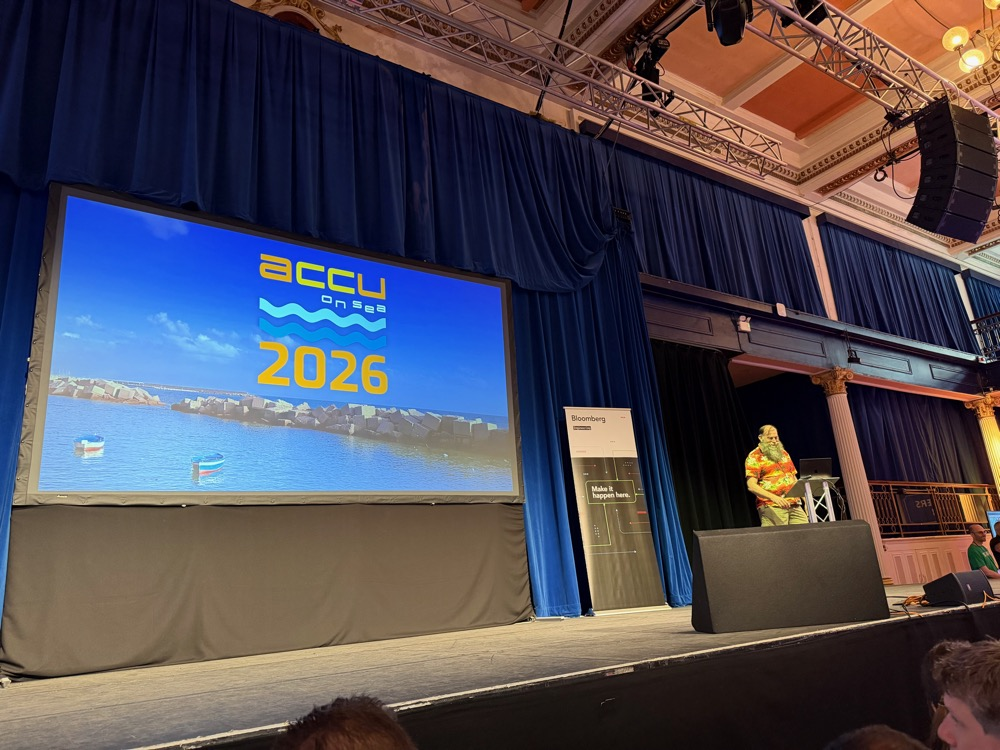

Last week I swapped the usual conference hotel ballroom for a Victorian
hall perched on a cliff above the English Channel. **ACCU on Sea 2026** -
the UK's international developer conference *by the sea* - took over **Leas Cliff Hall
in Folkestone**.

## About ACCU on Sea

For the uninitiated: **ACCU on Sea** is the international developer
conference that takes place *by the sea*, in the UK. It's what you get when
two much-loved communities - the **ACCU Conference** and **C++ on Sea** -
join forces into a single, blockbuster event.

The **ACCU Conference** is one of the longest-running developer conferences
in the world. Established by the ACCU organisation back in **1997**, it has
always been open to the whole community and has consistently sat at the
forefront of what's happening in the world of software development.

And while its roots are firmly in C and C++, that community expanded long
ago to embrace other language ecosystems. Across the programme you should
expect content on C#, D, F#, Go, Haskell, Lisp,
Python, Rust, Swift, and more - alongside the perennial sessions on *how to do programming right*.  

This year, C++ and safety, Rust and AI topics happened to dominate my own schedule - but a few rooms over, the conversation looked completely different, and that breadth is precisely the point of this event.

---

## The Venue

ACCU on Sea is hosted at the **Leas Cliff Hall** in **Folkestone**, Kent,
UK, overlooking the English Channel. This historic seaside town is also
home to the **Channel Tunnel** and, as such, has excellent links to the
rest of Europe.

The Leas Cliff Hall is a working theatre that also has a dedicated
conference suite. Built into the cliffs, and with floor-to-ceiling glass
overlooking the sea on three sides, the views are spectacular - if the
classic British fog doesn't get in the way. 😄

---

## The Sessions

Four packed days, five tracks, a who's-who of speakers, and a coffee
queue with a sea view.  

https://accuonsea.uk/2026/schedule/index.html

Here are my _favorite_ sessions and a few impressions. If there's one sentence that sums up the week: **AI** and **memory safety**
were the two gravitational fields that everything else orbited.

## Wednesday 17 June

### KEYNOTE - The Next 20 Weeks of Systems Engineering
**Andrei Alexandrescu - Principal Research Scientist, NVIDIA**

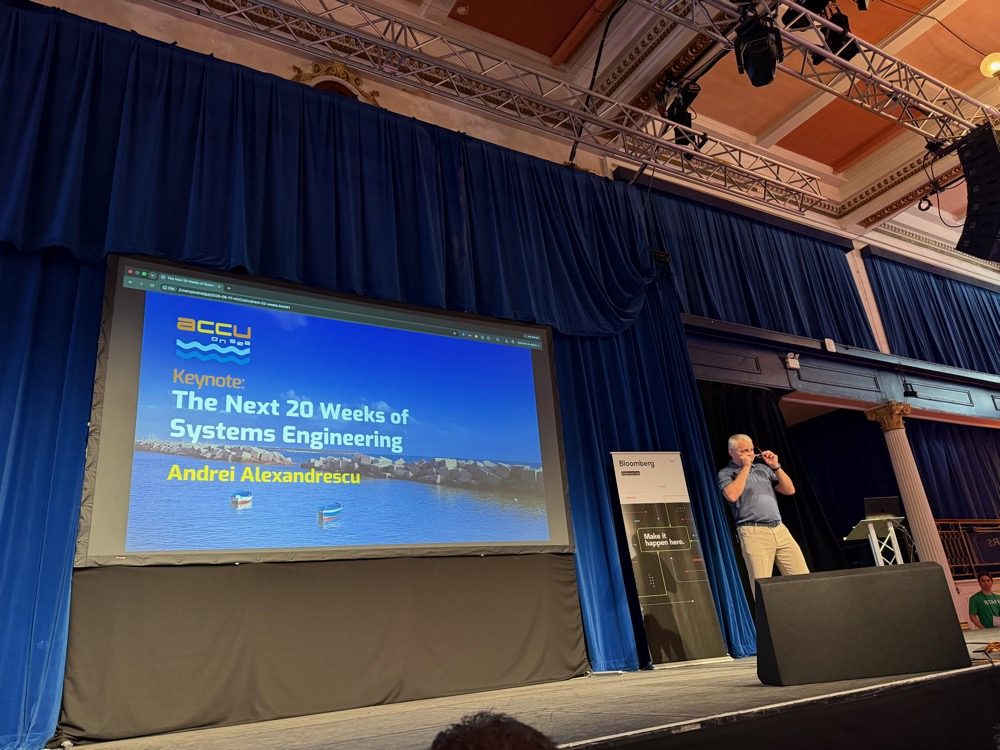

This was, for me, the most impactful session of the whole conference - the
one I'm still turning over in my head a week later. It opened with a running
gag that doubled as a thesis: the title slide read "The Next 20 *Years*,"
then "*Months*," then "*Weeks*" ("I had high ambitions," he deadpanned). The
shrinking horizon is the point - nobody can credibly forecast 20 years of
anything right now. So instead of another "how I used AI" war story, Andrei
promised "a few considerations that will stand the test of time," all
anchored on a single claim: **abstraction has been, is, and will remain the
central organizing principle of software development.** He even staged the
talk as a play - *"Abstraction: A Drama in Five Acts."*

**Act I - How did we get here?** A brisk history of complexity. The 1980s-90s
"Software Crisis" produced a parade of would-be saviours - heavyweight
methodologies, CASE tools, non-text and specification languages - united by
one instinct: *anything as long as it's not code*, abstracting the problem
away from its implementation. By the 2000s the industry had inverted that
into "the code *is* the design," and built open source, design patterns,
tests, source control, and Agile around that idea.

**Act II - The Age of Inversions.** The heart of the talk, and the slide
everyone photographed. Now that code production is commoditised (and
automation keeps accelerating it), the balance tips hard from *producing*
code to *reviewing, understanding, and being accountable* for it. Programming fluency
gets de-emphasised, and a set of genuine role reversals emerges - from *creator in control of primitive systems* to *accountability sink of AI systems*.

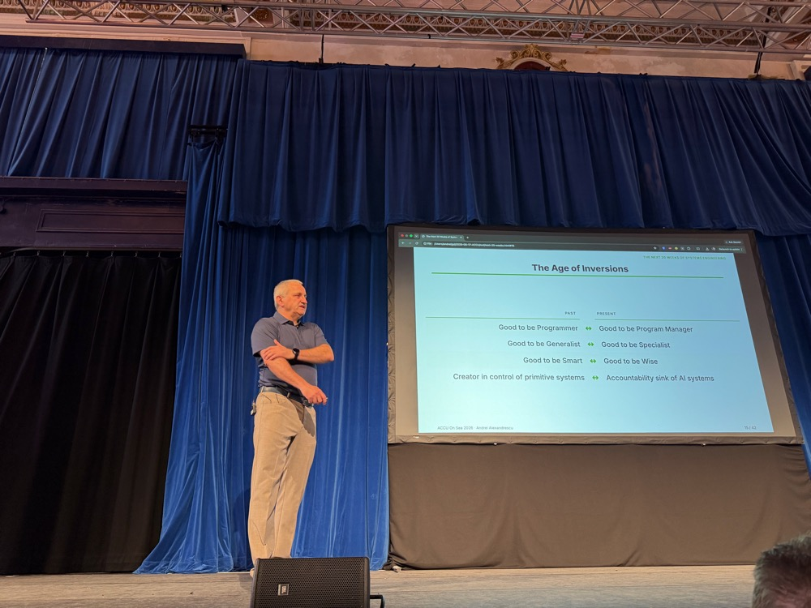

The asides here were some of my favourites. *Metacognition* is on the rise:
we now ask the agent how to use the agent - tools that teach us how to use
them, which really is unprecedented. The relationship between specification
and tooling has flipped from "precise spec, dumb tools" to "vague (i.e.
*highly abstract*) spec, smart tools." And the ultimate abstraction, he
argued, is the phrase **"as appropriate"** - as in "add unit tests as
appropriate" or "use the Visitor pattern as appropriate" - which only works
on top of decades of shared, high-level understanding. One line stuck with
me: *the more knowledge you have, the less creativity you need.* The caveat:
inversions like these aren't unique in history, and we'll oscillate between
dystopian and utopian readings for a while yet.

**Act III - On to Babel: the role of languages.** Why keep evolving C++26 at
all? Because each headline feature is really a new abstraction: **Contracts**
abstract *obligation*; **Reflection** abstracts *code itself*; and
`std::execution`, `std::simd`, and metaprogramming follow suit - features
earn their keep in proportion to the abstraction they add. But he raised an
unsettling possibility: a *"post-Cambrian"* era for languages. Incumbency may
be a language's single biggest advantage, and there's a "curse of novelty" -
an AI can pick up a new language by analogy to the ones it already knows, yet
the whole *point* of a new language is its new idioms. We may be watching the
end of a uniquely creative era of language design.

**Act IV - Abstraction of abstraction.** The technical core, with C++
metaprogramming as the cautionary tale: template metaprogramming is a
"rigorously unstructured," accreted abstraction whose Turing-completeness was
*discovered*, not designed. Reflection is the way out
(`static_assert(metaprogramming == programming)`: types become values, you
metaprogram by ordinary *programming*, then expand back to types - "perfect
for AI and for us"). The insight that landed hardest: even if an AI can
generate any code you ask for, *you can define any instrumented class, but
without reflection you can't define the **notion** of an instrumented
class.* Abstraction is what lets you name and reuse the concept rather than
the instance - and that is exactly what has to **survive code generation**,
because instantiation deletes abstractions and asking an AI to reconstruct
them afterwards is wasteful. Better abstractions, he noted, help AIs for the
same reason they help people: both have finite reasoning resources (for an
LLM, your context window).

**Act V - Going forward.** He closed with seven deliberately provocative
predictions:

> 1. AI will define and use its own abstractions
> 2. Software projects will increase in size
> 3. "As-if" on steroids is coming to compilers
> 4. Compilers will be architected for *dialog* with agents
> 5. Prompt engineering has no future
> 6. A possible revival of specification languages
> 7. We are in the *bubblesort era* of AI-assisted coding

The final slide was simply **"We Will Adapt."** Coming from someone who had
just walked us through his own "checkered personal record" of past
predictions (with a wry nod to Gartner's ~90% miss rate), it didn't land as
hubris - it landed as the most durable takeaway of the week.

### Rust for the Curious C++ Developers
**Victor Ciura** *(my talk)*

Then it was my turn. Right after Andrei set the tone - and following the
coffee break - I took the main stage to dig into a question close to my
heart: what is it actually like to come to Rust *from* C++? I walked
through the gaps, the needs, the gems, and the tooling a C++ developer
should know about - where my favourite C++ features show up (or don't) in
Rust, the idiomatic parallels between successful strategies and features in
both languages, and their respective strengths. There's a wealth of good
guidance out there - guidelines, opinionated best practices, established
idioms - but it's tangled up with a fair few *myths*, and I took the
opportunity to dissect a few of the most impactful ones. The throughline,
and the reason I keep coming back to this talk: what have we learned that
we can bring back to our day-to-day C++?  
[ I was a little too busy on stage
to grab a photo of this one. ] 😄

### Contracts, safety and correctness
**Lucian Radu Teodorescu**

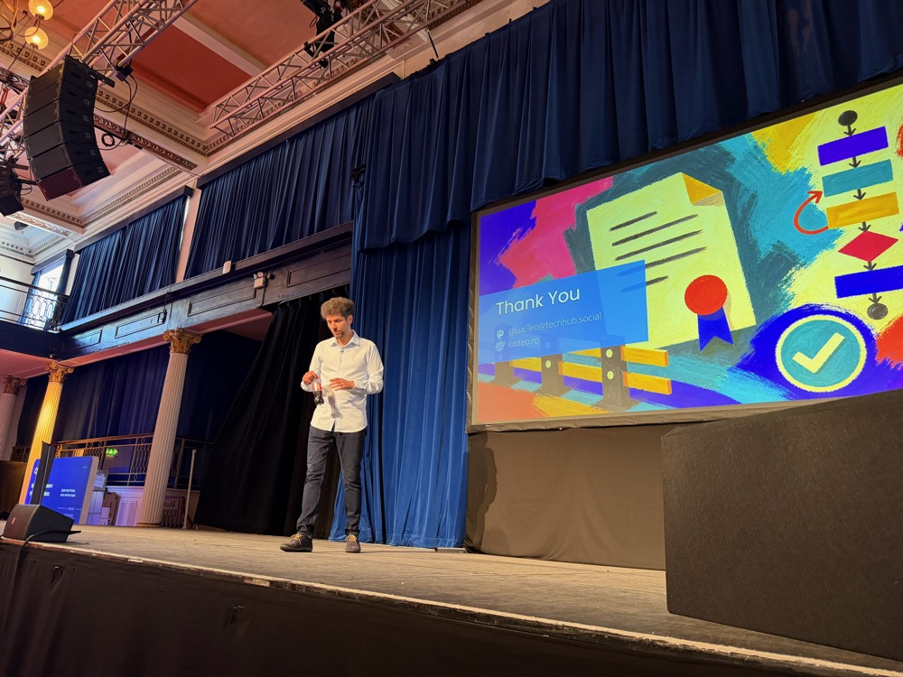

Since 2023, "safety" has dominated the C++ conversation - and become so
overloaded that some people now avoid the word entirely. Lucian carefully
untangled *safety* from *correctness* and positioned C++26 **Contracts**
within that landscape: what they can and cannot guarantee, and how to use
them to genuinely improve correctness (with practical examples). He closed
by stepping back to a small set of design and coding practices for safer,
more reliable C++ that go beyond contracts.

### Postmodern Programming
**Tony Van Eerd**

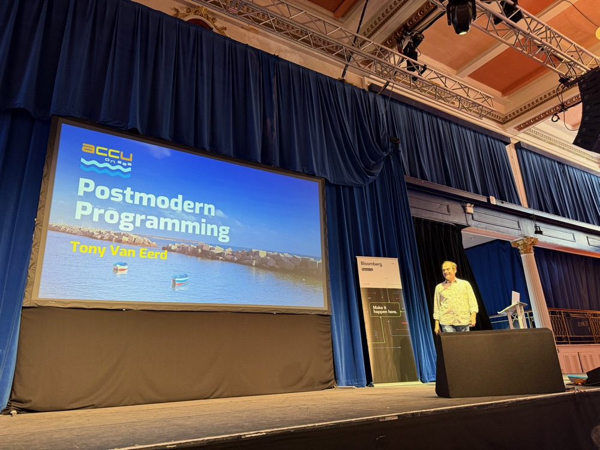

Tony's most-requested talk, and you can see why. An unusual, free-wheeling
meditation on programming, postmodernism, communication, functions, and
*context* - with the lofty, semi-serious goal of fundamentally changing
how you think while you code. Hard to summarize, very much worth seeing. **Dr. Seuss** would approve 😄 

### ⚡ Lightning Talks

The evening lightning talks are an ACCU institution: five minutes each,
fast, varied, and occasionally profound. The line-up was a joy.

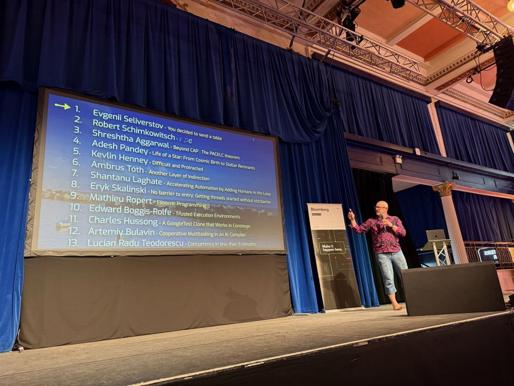

Highlights included Kevlin Henney's **"Difficult and
Protracted,"** Mathieu Ropert on esoteric programming, Adesh Pandey on the
life of a star, Shreshtha Aggarwal on the PACELC theorem, and Lucian Radu
Teodorescu squeezing **"Concurrency in less than 5 minutes."**

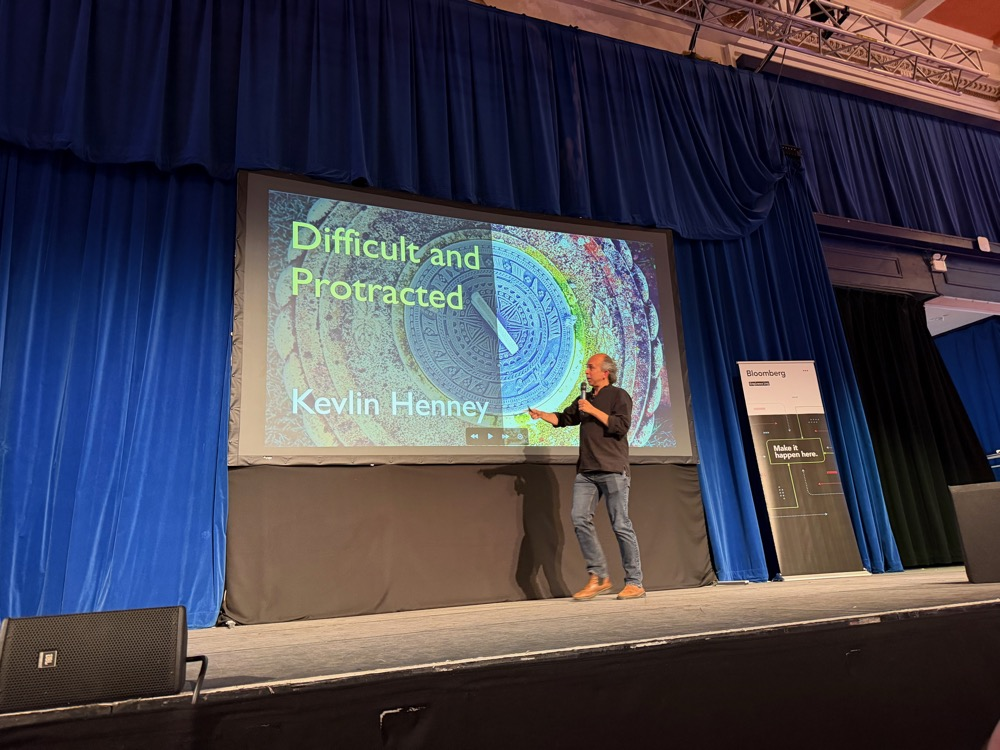

Chris Oldwood also took the mic with **"The Slop Bucket"** - a perfectly
on-theme nod to the week's obsession with AI-generated code.

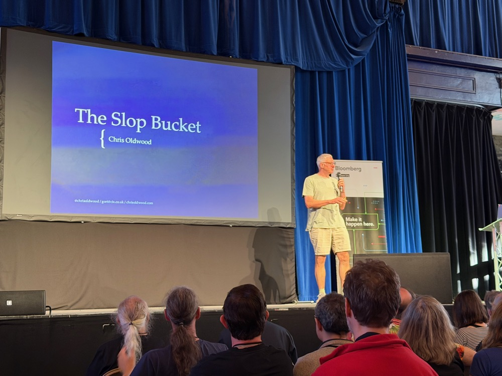

---

## Thursday 18 June

### KEYNOTE - In the Beginning: A Genesis of Our Craft
**Walter E Brown**

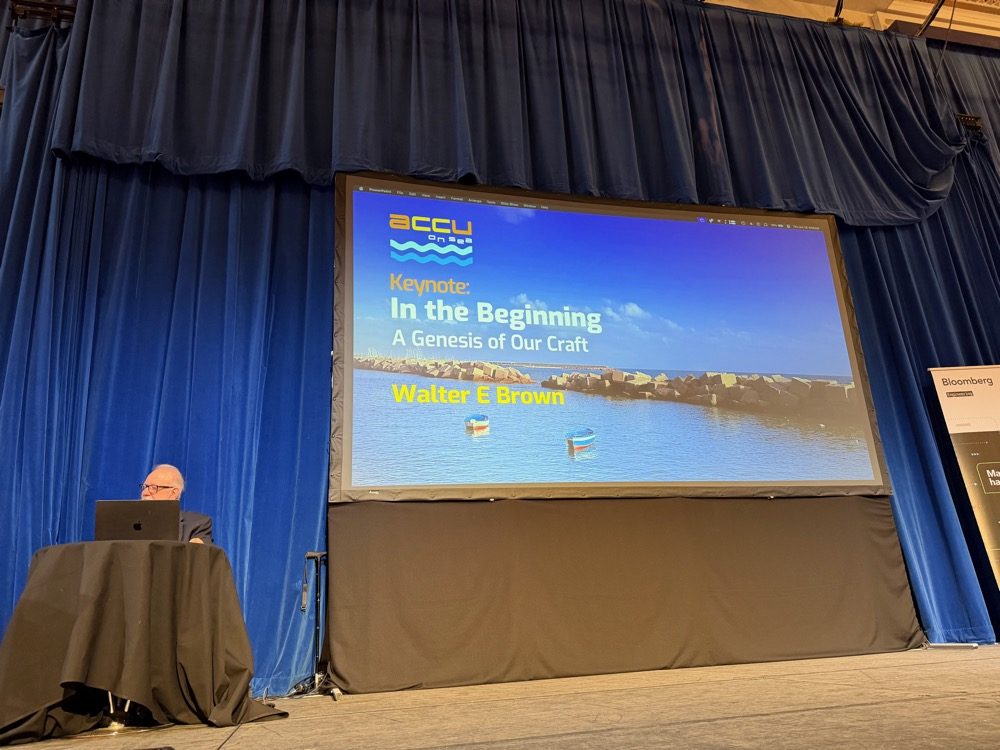

"By reviewing the past, we gain new insights." Walter took us back to the
pioneering programming languages of the 1950s and traced how many idioms
we cherish in modern C++ have roots there - part technical history, part
reflection on our role as applied scientists. Fittingly for a talk full of
archival film clips, he asked the room to put cameras away and not record,
so the title slide above is the only frame I caught. You had to be there -
which was rather the point.

### Our Journey Toward a Fully Backward-Compatible, UB-Safe, ISO C++
**John Lakos**

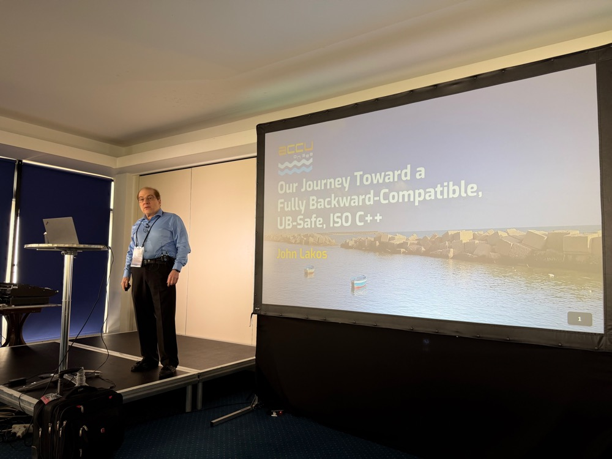

John laid out an uncompromising vision for UB-safety: *every* potential
source of undefined behavior should be detectable via runtime checking,
which eliminates the very notion of "safe" and "unsafe" regions of a
program - there's nowhere for UB to hide, and no need to switch languages
or subsets. He showed how C++26 Contracts provide the foundation, letting
teams spend their runtime-checking budget exactly where it's most
valuable, and sketched an incremental path that applies not just to new
code but to the vast body of existing C++ already in the wild.  
I have personal reservations about the feasibility of such claims, but I'll reserve these comments till the end/conclusions of the report, since more sessions in the program had this topic (Contracts). 

### Creating Composable Callables in Contemporary C++
**Björn Fahller**

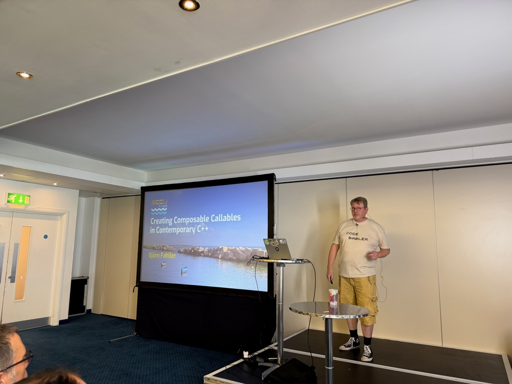

Ranges made C++ far more composable in C++20/23/26, but function objects are still surprisingly rare and rarely composable in everyday code.
Björn built up - with deliberate, gleeful scope-creep - a powerful and
easy-to-use toolkit of composable callables that, thanks to recent
language additions, requires remarkably little code. No runtime performance compromises.  
As usual, Björn's presentations and topics resonate very well with my personal thinking and preferences. 

### CallMeMaybe: Building Modern Runtime Reflection via C++26
**Laurie Kirk**

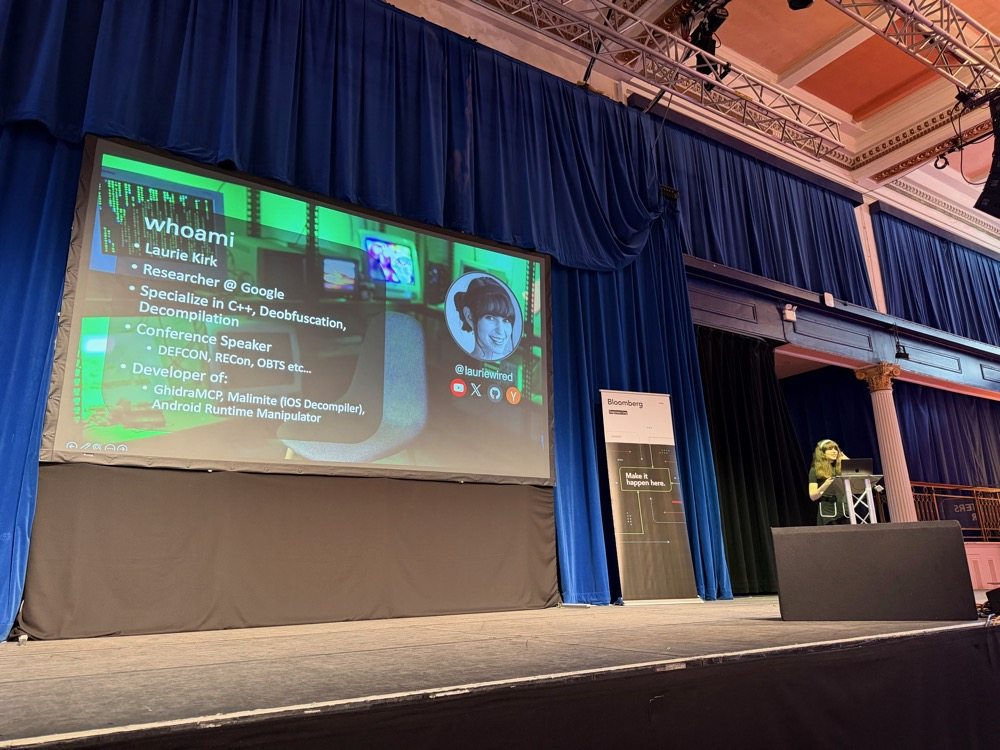

One of my favourites for sheer "I didn't know you could do that" factor.
Using C++26's new static reflection, Laurie built an automated, type-safe
**runtime** reflection registry that only pays for the classes that opt in - no manual macro registration (RTTR), no Qt `moc`, and none of the
Java-style overhead of storing metadata for every class. She covered
signature-based deduplication, invocation benchmarks, symbol stripping via granular reflection control, and "reflectable" profiles built from
attributes and concepts - then introduced a brand-new open-source library built on C++26 reflection. 

### 🍿 Movie Night
**Walter Brown** 

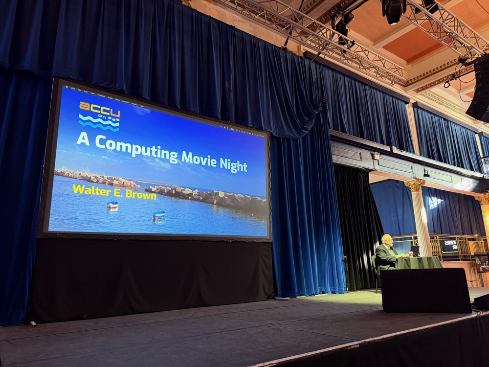

A lovely change of pace: an evening of video excerpts and short films
celebrating the programming profession and reflecting on where our craft
came from. Beer, kebabs, popcorn, and a full house. 

---

## Friday 19 June

### The Performance Mindset
**Mathieu Ropert**

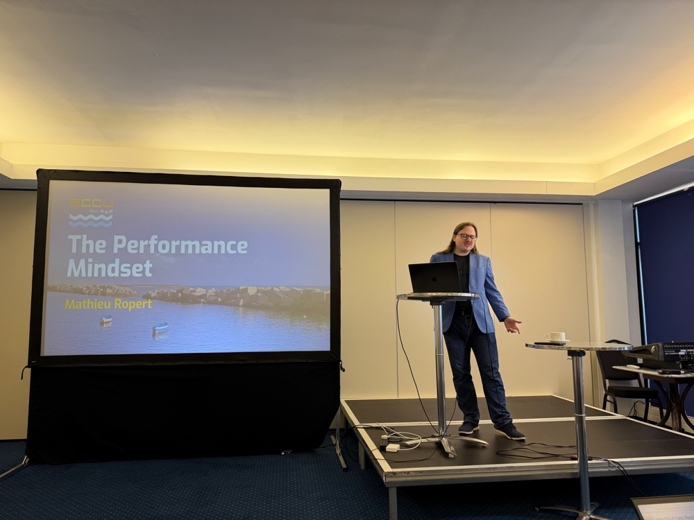

Performance is never an accident, and never an afterthought. Mathieu told
the story of a 2x speed-up he made for a game as a side project - but the
talk was less about the code and more about the *mindset* that made it
possible: profiling, learning, planning, curiosity, and plain personal
motivation. Mathieu is an entertaining speaker, so the hour just flew by :) 

### Stop Boiling Your Frogs: High Impact Fixes to Problems of Scale
**Lara Bailey**

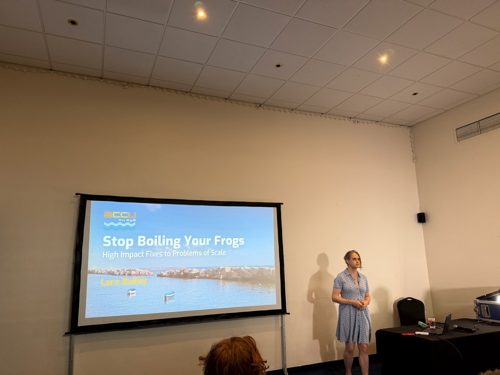

Reasonable-looking code often misbehaves only at scale. Lara showed how to
hunt for the highest-leverage places to intervene, where a small
engineering effort yields an outsized win. The memorable examples: two C++
classes used just outside their design space were quietly exhausting
memory in a data-warehouse build; swapping them for better-suited ones
turned multi-hour builds into minutes and cut memory use by an order of
magnitude.  
Slow paced, insightful reflection on how to do better engineering. Packed room and lovely audience interaction. Very ACCU-like! 

### Software and Safety
**Anthony Williams**

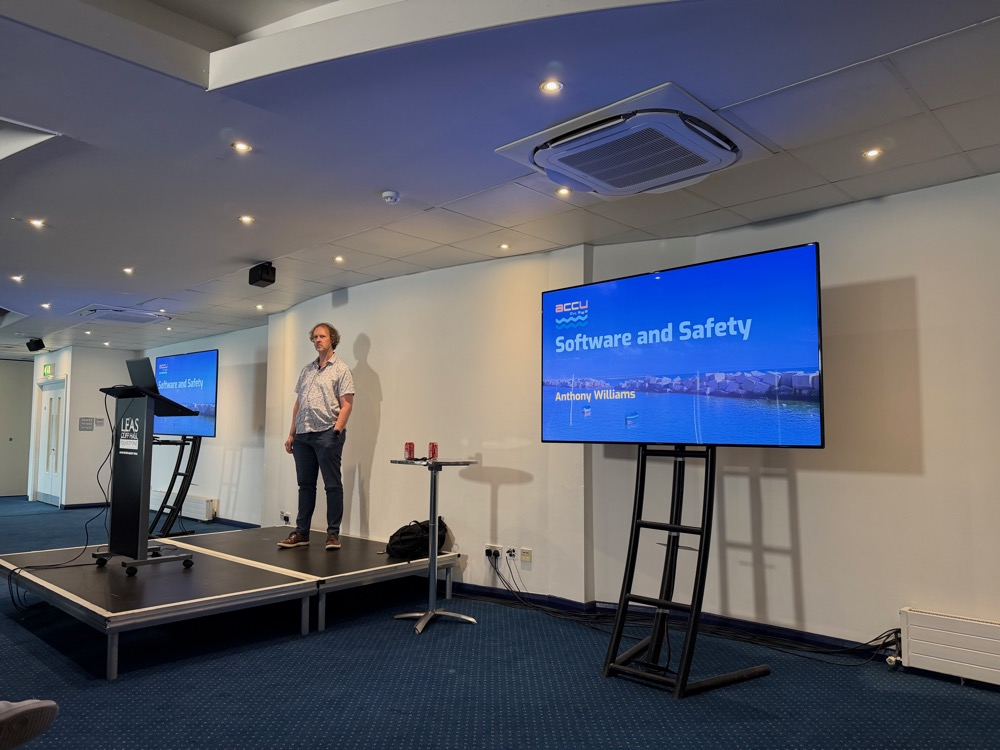

Software is *everywhere* - toasters, pacemakers, cars, trains, the public
services running quietly in the background. Anthony asked what end-users
actually mean when they call software "safe," how that maps to what we do
as developers, and what we - specifically as C++ developers - should be
doing to meet those expectations. Very wide/high-level presentation, but profound in its messaging for the community, not just for safety-critical industry. 

### KEYNOTE - Out of Our Minds: What is AI Doing To Us and For Us?
**Yvonne Rogers**

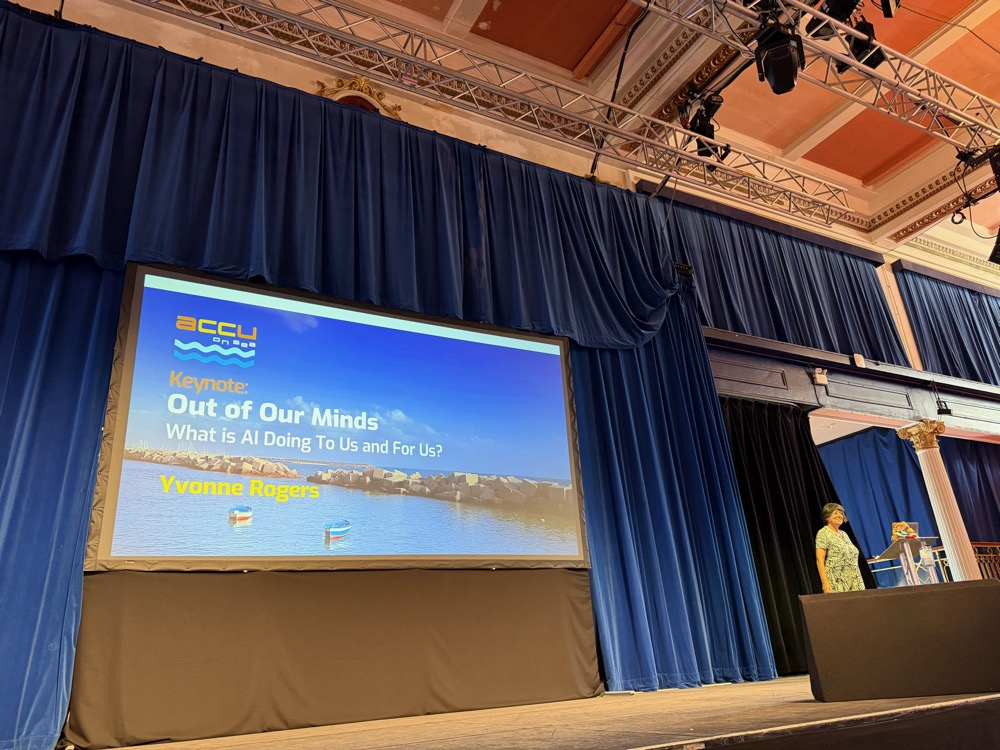

A perfect human-computer-interaction counterweight to the week's C++ deep
dives. The phrase "out of our minds" refers to how we externalize and
offload cognitive work - through writing, drawing, talking - and GenAI is
the latest, very different tool for doing it. Yvonne explored the *paradox
of effort*: outsourcing our thinking to AI can make work less effortful
but also less rewarding. Her challenge to the room: how do we design AI
tools that make work *more* effortful and more rewarding, supporting
better reasoning and - in the coming agentic era - genuinely collaborative
decision-making?  
Dr. Rogers took ample time to answer a lot of audience questions at the end. Lots of interest in this topic! 

---

## Saturday 20 June

### The Code is Documentation Enough
**Tina Ulbrich**

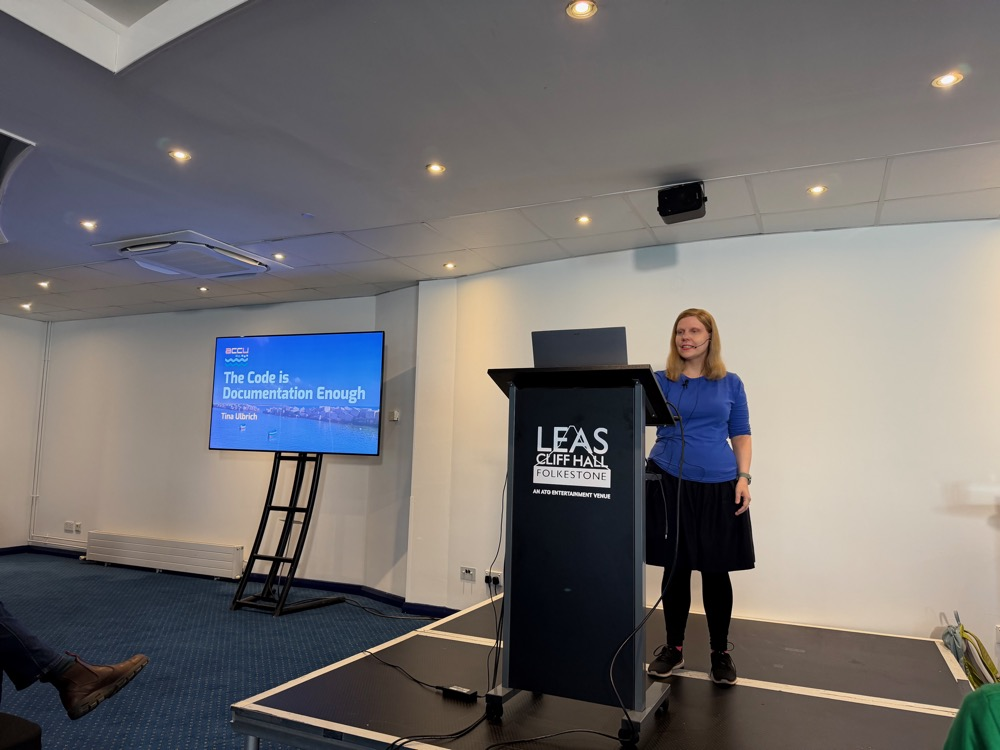

Click-bait title, of course. But the presentation was profound and very well delivered. With lots of code examples.  
Opening with Stroustrup's "the compiler does not read comments, and
neither do I," Tina made the case for self-documenting code: how to name
variables and functions, which language features improve readability, and
how unit tests can serve as living documentation of intended usage. And,
honestly, where a comment really *is* the right tool - and how to write a
good one. 

### Microarchitecture: What Lies Beneath
**Matt Godbolt**

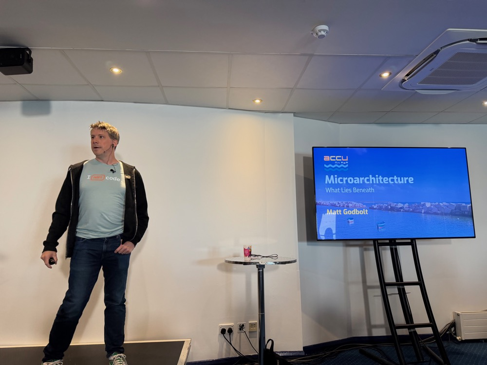

You know modern CPUs do out-of-order execution and branch prediction; Matt
went *much* deeper, into the guts of Intel Skylake - register files,
schedulers, memory disambiguation - following a real code snippet down the
pipeline into the real-world complexity that the textbooks skip. Essential
for latency-sensitive systems, and genuinely fascinating for everyone
else.  
The room was overflowing, the presentation was packed with information and Matt did a great job keeping the crowd engaged with a very complex topic and lots of information. 

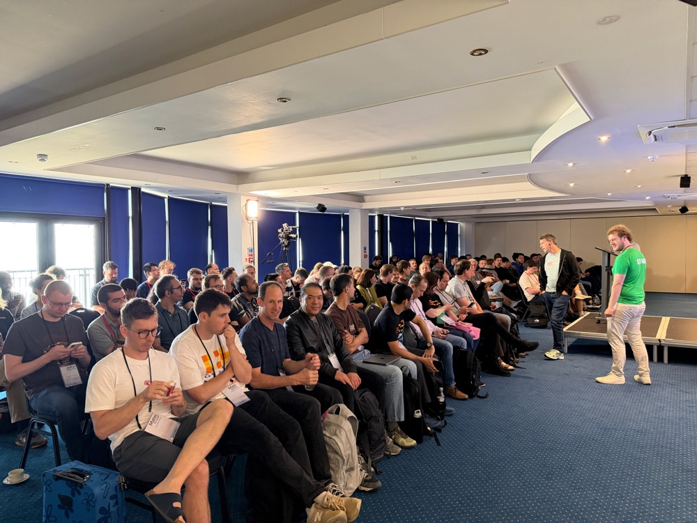

### The Future of C++ Is Memory Safe
**Jon Bauman**

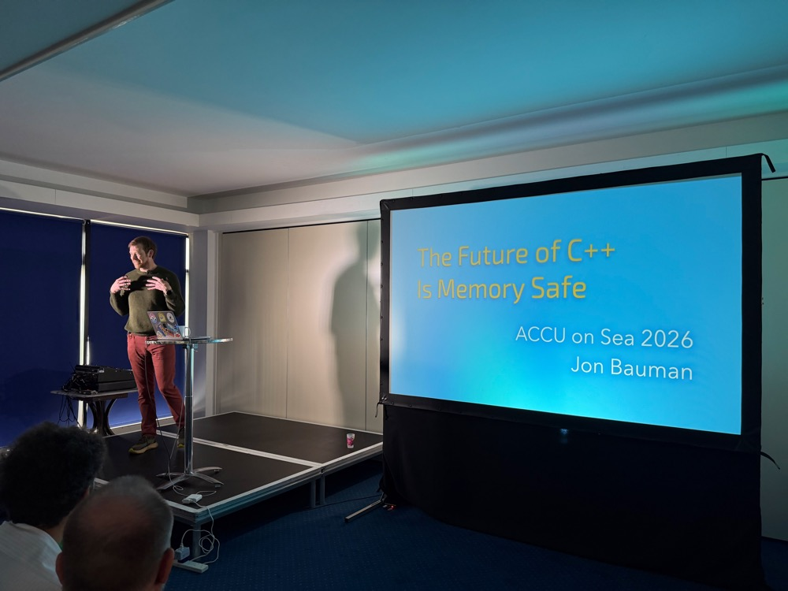

C++ rose to prominence decades before memory safety was a mainstream
concern, yet the vast majority of security vulnerabilities are
memory-safety bugs, and the pressure from industry, academia, and
governments keeps growing. Jon's optimistic thesis - backed by results
from some of the largest C++ codebases in the world - is that the vast
majority of *old* code does **not** need to be rewritten, and that C++ can
and should evolve to give *new* code memory safety, securing the
language's future. This is a particularly interesting take since Jon comes from the Rust world, and just recently refocused his attention to securing C++. 

### CLOSING KEYNOTE - Incrementally Securing Your C++ Using Rust
**Taylor Cramer**

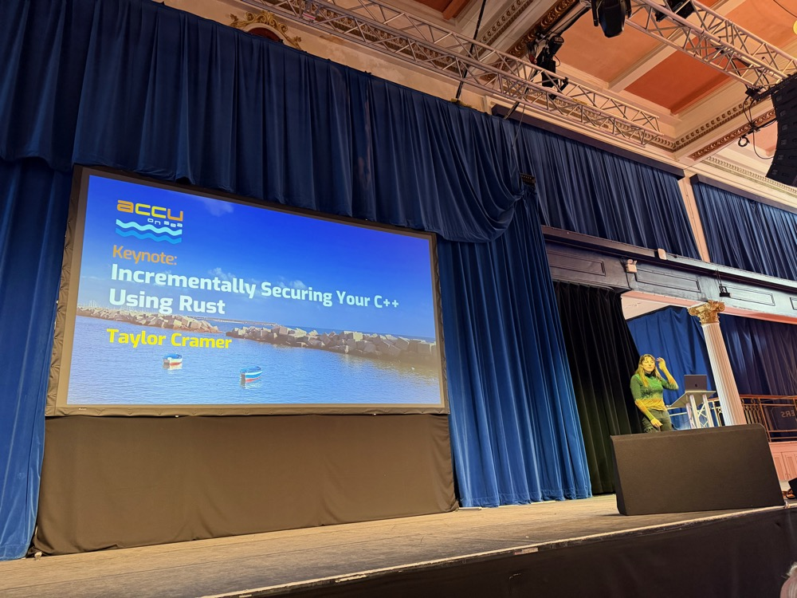

The week's two big themes - AI and memory safety - collided in the closing
keynote. Systems software runs on C and C++, and AI now makes
vulnerabilities easier than ever to find and exploit before they can be
patched. Taylor's pitch: you don't have to choose between "keep your C++"
and "rewrite everything in Rust." Using Rust libraries, cross-language
interop tooling, and a sprinkle of AI, teams can adopt memory safety
*incrementally* - specifically through **Crubit**, the Rust/C++ interop tool that Taylor's team is building. 

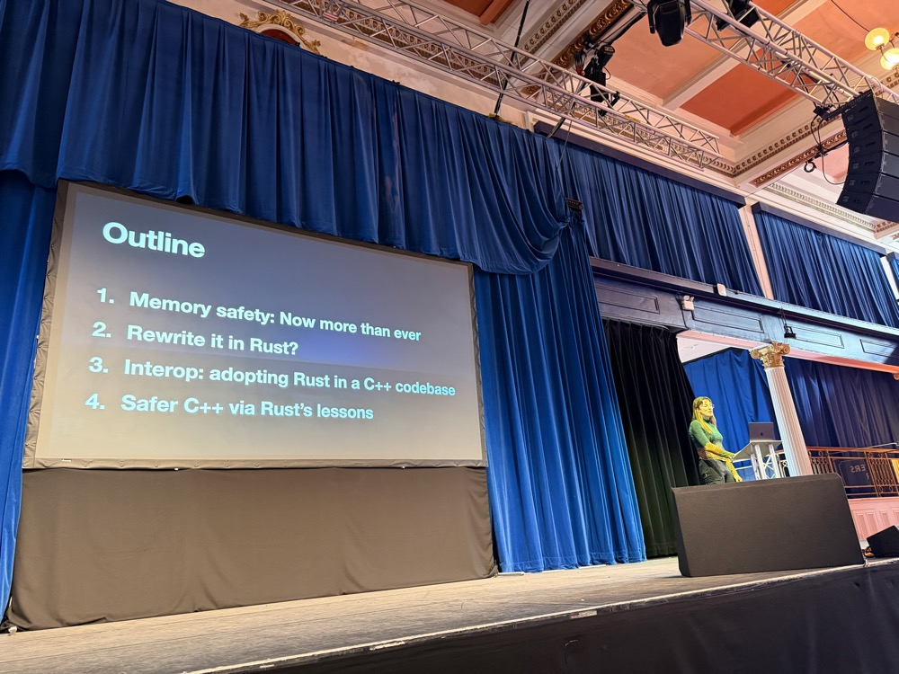

The presentation pillars framed it neatly: **memory safety** (now more than ever), **rewrite it in Rust**, **smooth interop** - adopting Rust in a C++ codebase, and **safer C++ via Rust's lessons**.  

Taylor's closing plenary was the perfect bookend for **my own** presentation at the beginning of the conference: [Rust for The Curious C++ Developers](https://accuonsea.uk/2026/sessions/rust-for-the-curious-cpp-developers/).  

---

## The Hallway Track

A conference is much more than its talks, and ACCU on Sea nailed the
in-between. The grand main hall regularly filled to the back,
where the sponsor exhibition spilled around the gilded columns of the Victorian-style theater. 

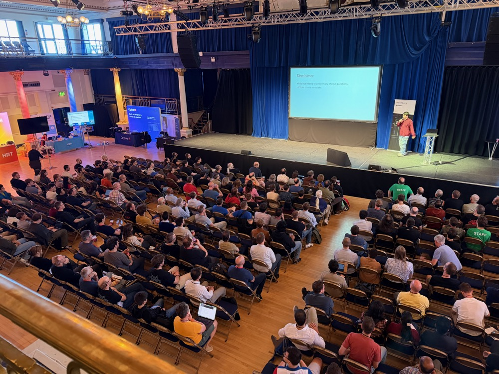

Sponsors: The exhibition was a roll-call of the systems-and-finance C++ world -
Bloomberg, Hudson River Trading, Optiver, Citadel Securities, WorldQuant,
think-cell, Undo, G-Research, Ripple - with the requisite swag, coffee,
and recruiting energy.

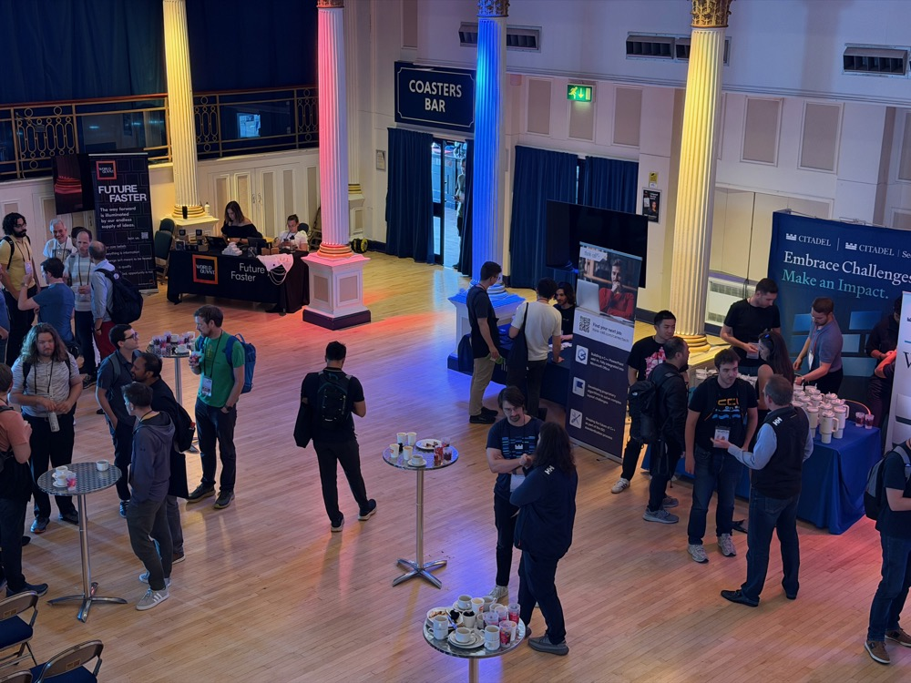

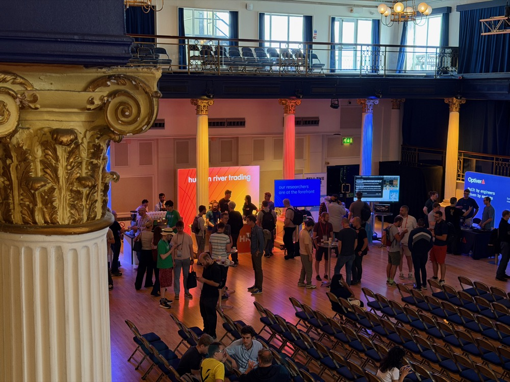

---

And then there was **the setting**. Few conferences offer a coffee break with
*this* view: the Folkestone seafront, the harbour arm, and the Channel
stretching out to the horizon.

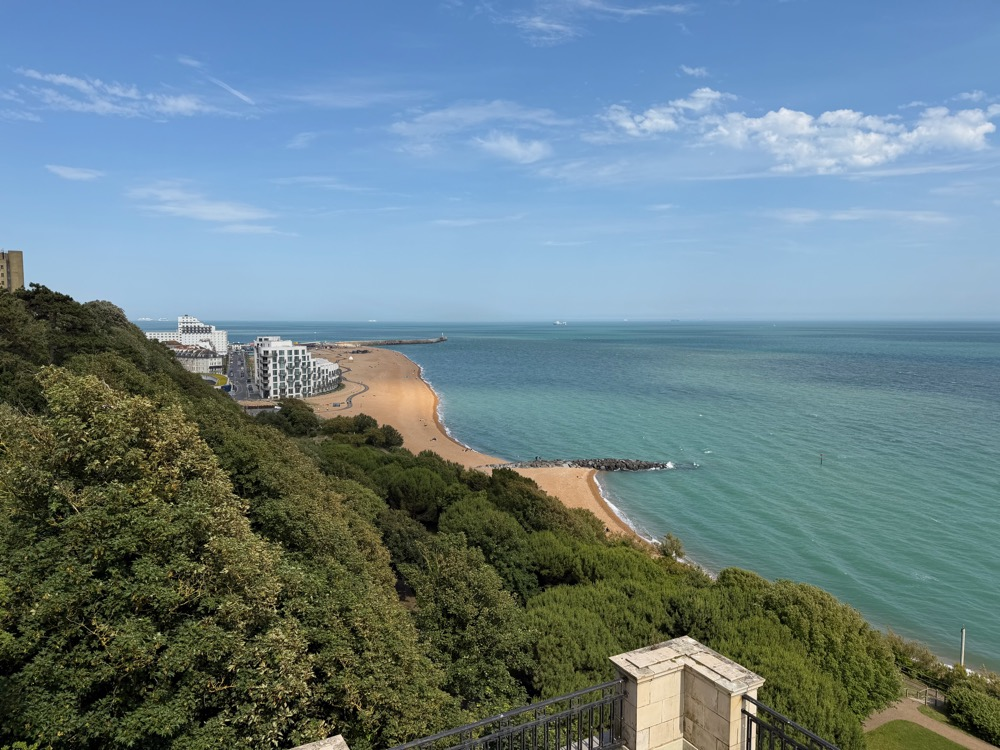

---

## Themes I took home

- **AI is the new substrate.** Two keynotes (Alexandrescu, Rogers) and a
  thick seam of talks treated AI not as a novelty but as a force reshaping
  what software engineering *is* - shifting the prize from producing code
  to understanding systems, and asking hard questions about effort,
  judgment, and what we offload.  
  **The Age of Inversions**: Now that code production is commoditized (and automation keeps accelerating it), the balance tips hard from producing code to reviewing, understanding, and being accountable for it. Programming fluency gets de-emphasised, and a set of genuine role reversals emerges - from creator in control of primitive systems to accountability sink of AI systems.  
- **Memory safety has gone mainstream - and pragmatic.** The closing
  keynote, Bauman's talk, and Lakos's UB-safety work all converged on the
  same pragmatic answer: don't rewrite the world; secure *new* code and
  adopt safety *incrementally* (Rust interop, contracts, runtime checks).
- **C++26 Reflection is arriving in force.**  People are already finding new interesting scenarios where this might become a game changer. I've already seen a few cool ideas at this conference, but I'm sure this is just the beginning of 10+ years of _innovation_ and _abuse_ to come :)   
- **C++26 Contracts: promise and pushback.** Contracts were the thread
  running through the safety conversation - Teodorescu using them to separate
  *safety* from *correctness*, and Lakos building a whole UB-safety vision on
  them, where *every* source of undefined behavior becomes detectable at
  runtime with the cost paid only where you can afford it. The honest
  counterpoint: the most common UB is a *lifetime* error - use-after-free and
  friends - and there's no magic incantation you can write for that;
  configurable runtime assertions have existed for 35-40 years, yet we still had to built something like Rust to solve the industry problem for good 😈. Contracts look less like a silver bullet than a genuine-but-partial
  step forward - a standardized construct compilers and sanitizers can both
  reason about, without by itself making C++ _truly_ safe. 

## It's a wrap

Looking forward to the next year's conference by the sea! In the meantime, I have a bunch more C++ and Rust conferences in my 2026 calendar...
