# RustConf 2026 - Trip Report

I attended [RustConf 2026](https://rustconf.com) in Montreal 🇨🇦, during September 9-11. My thread through the conference leaned heavily toward C++/Rust interoperability, the parts of Rust's safety story that still need explicit specifications and tooling, and the engineering work involved in adopting the language at scale. There were also many opportunities to connect those technical discussions with another recurring question: how to sustain the people and infrastructure behind Rust project & ecosystem.

## Attendees

This year, we had **680** onsite attendees in Montreal and **1,076** virtual attendees joining from all over the world.

## The Venue

Back in Montreal, after two years. This time we were hosted by the wonderful [Palais des Congrès de Montréal](https://congresmtl.com/en/), where we had plenty of space for sessions, breakout rooms, expo, collaboration and meetups/socials. 

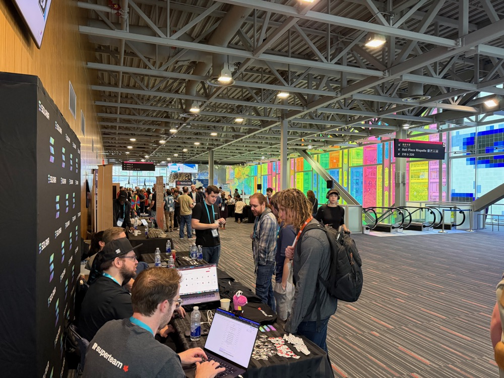

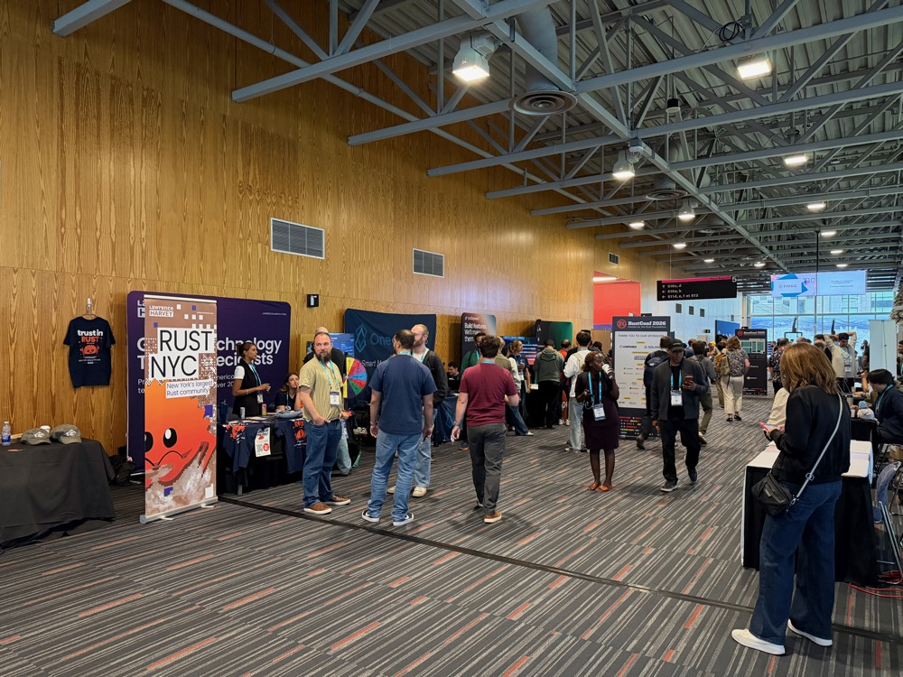

## The Schedule

The weekly program was packed, including pre/post events. Workshops, sessions, breakouts, meetups, project updates, Rust Foundation Summit, various study groups, and the traditional UnConf to close the week. 

Check out the full [schedule](https://rustconf2026.sched.com) to see what happened, and bookmark the sessions you want to look for when they [land on YouTube](https://www.youtube.com/@rustfoundation/videos) in the following weeks. 

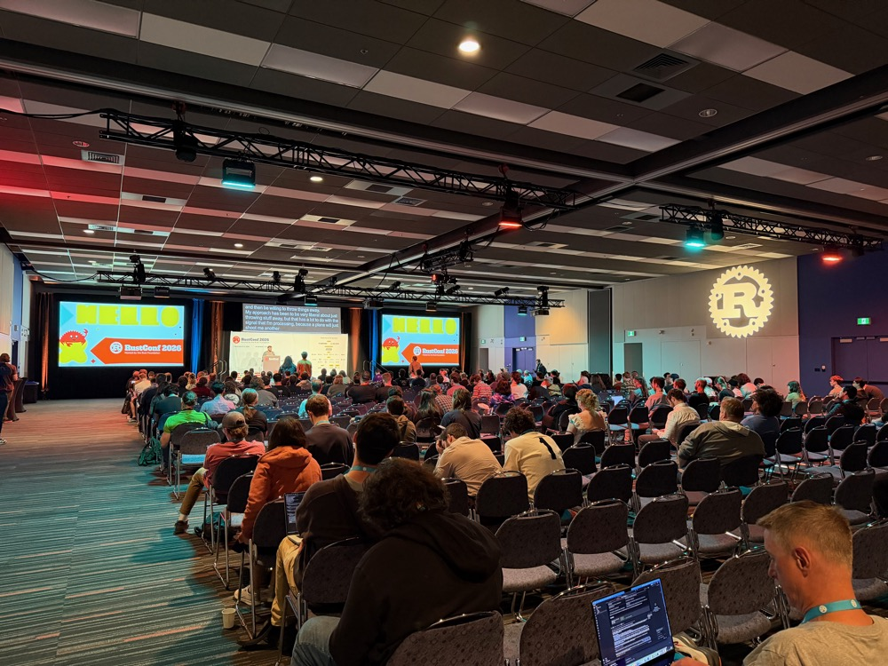

Here are some sessions and events I attended and are worth highlighting. 

## Wednesday, September 9

### Kick off

Our awesome emcee, Nell Shamrell-Harrington, driving the main track and guiding us through the conference program: 

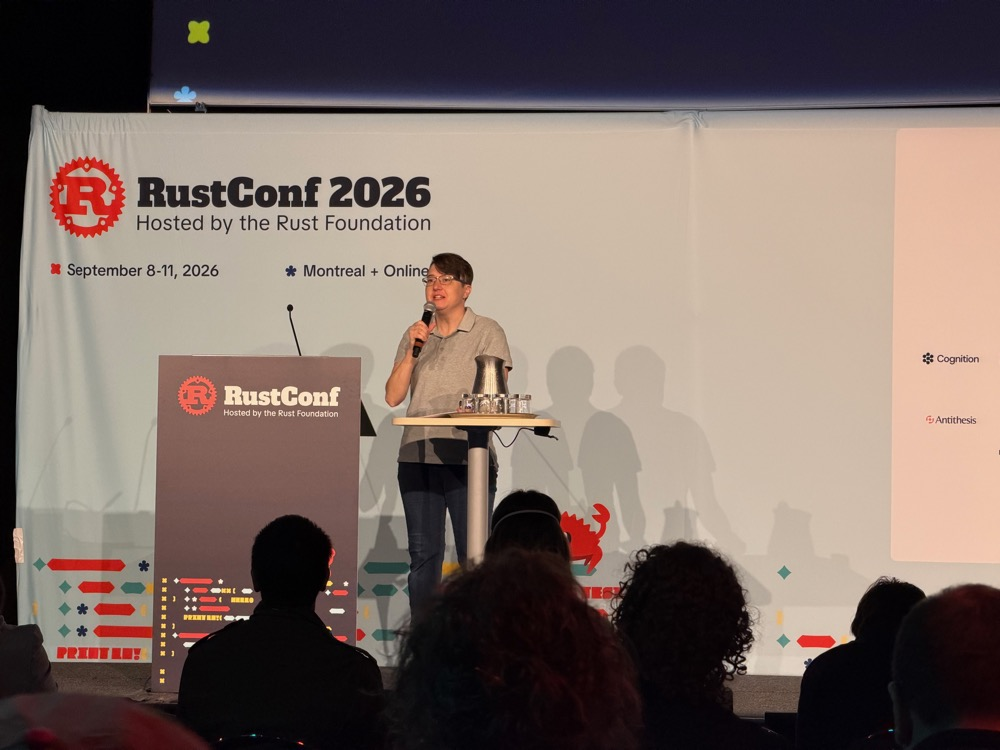

### Keynote: Rust Adoption at Scale With Ubuntu

By Jon Seager

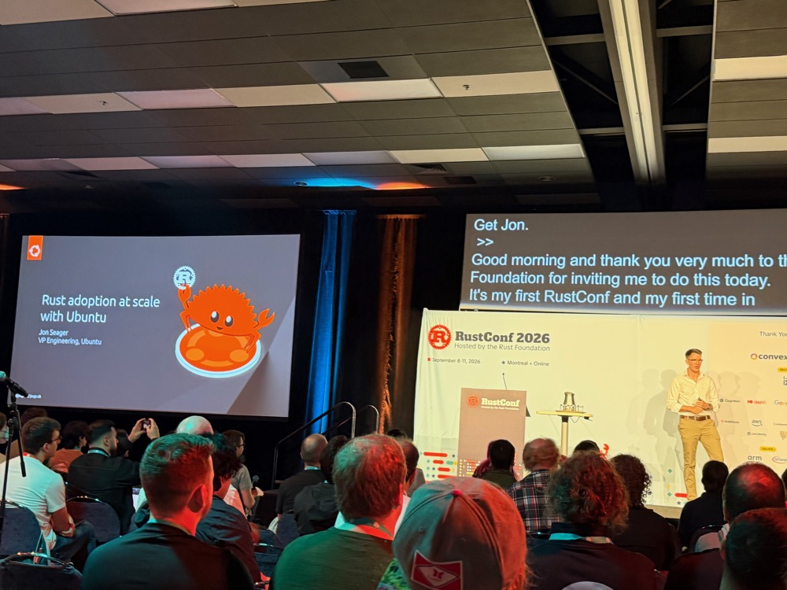

Jon Seager's keynote approached Rust adoption at the distribution level. The interesting question was not simply whether a system utility could be rewritten in Rust, but what happens when that implementation becomes part of an operating system that other people depend on. Jon traced Ubuntu's adoption of Rust-based replacements for core utilities and sudo, including the motivations, tradeoffs, and surprises along the way.

His account spanned two releases: Ubuntu 25.10 as an initial milestone, followed by Ubuntu 26.04 LTS. Jon connected the technical changes with Canonical's long-term support commitments, including the advertised 15-year support and security-maintenance horizon. He also covered upki, the collaboration between Canonical and Rustls, and the wider development experience for Rust on Ubuntu.

For me, this is the useful production-adoption framing: shipping a Rust implementation is one milestone; integrating it, supporting it, and making it dependable for existing users is the longer engineering commitment. That distinction matters just as much inside a large organization as it does inside a Linux distribution.

### Project Update: A Decade of Rustls

By Joe Birr-Pixton and Daniel McCarney

Joe Birr-Pixton and Daniel McCarney looked back over a decade of Rustls, which has provided a memory-safe TLS implementation for Rust projects since 2016. Their update covered the project's design decisions, lessons from maintaining a security-critical library, adoption across the ecosystem, and priorities for the next decade.

I see this as an important counterpart to the migration stories elsewhere in the program. Replacing an implementation gets the initial attention, but the accumulated maintenance work is what makes a foundational library worth depending on. Rustls provided a concrete example of that longer timescale.

### Project Update: Bringing Rust into Python

By Tomáš Šedovič

Tomáš Šedovič described the collaboration around bringing Rust further into the Python ecosystem. The starting point was familiar: Python users looking for native performance without giving up the development experience that makes Python attractive. Rust-backed modules are one part of that story; the proposal to use Rust in CPython and its standard library raises a different set of integration questions.

The update described the proposal made by two Python core developers in late 2025 and the communication that followed between Python core developers, PyO3 maintainers, and members of Rust's Cargo, language, and compiler teams. This was a story about identifying constraints, bringing in the right expertise, and working through concerns across project boundaries.

My takeaway is that language interoperability is also an organizational interface. A useful implementation is not enough on its own: the surrounding toolchains, maintenance expectations, and project communities have to be able to work together.

### Zngur: Simplified Rust/C++ Integration

By David Sankel

David Sankel presented Zngur from a perspective that is especially relevant to large C++ codebases: how do experienced C++ developers introduce Rust without first becoming experts in unsafe Rust or accepting awkward restrictions on the code they can expose? That is a more practical adoption question than simply demonstrating that a call can cross the language boundary.

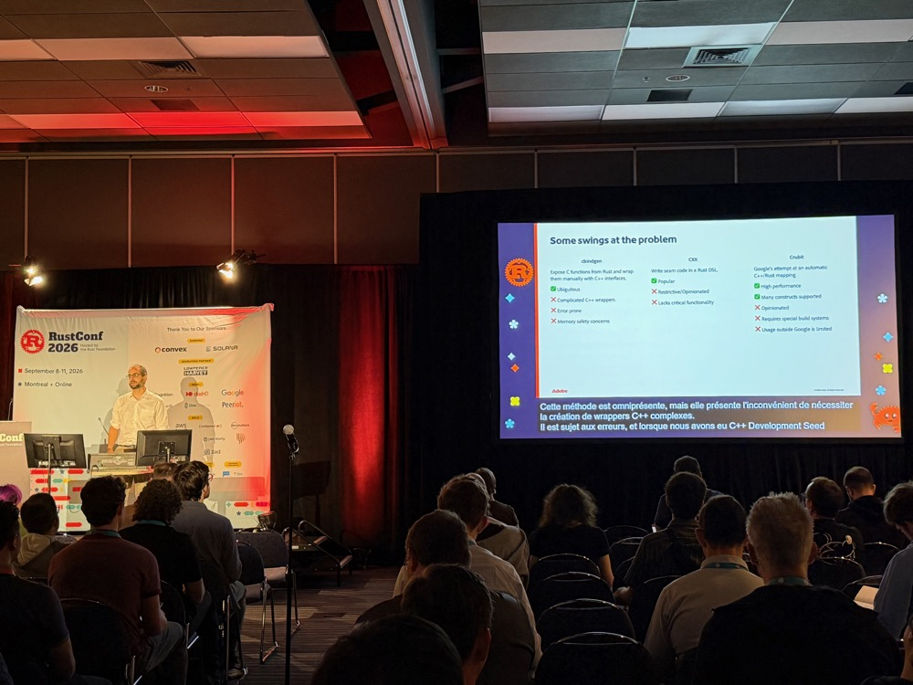

Zngur takes an intentionally C++-oriented approach. David's framing treats C++ semantics as broad enough to accommodate the Rust code being exposed. Calling Rust from C++ starts with declarations describing that interface; calling in the other direction involves a small layer on the C++ side. The session covered the architecture, basic usage, and considerations for applying it to an existing codebase.

The evaluation question I would carry back to our work is not just how much binding code a tool generates. It is which ownership and interface obligations remain visible to the engineers using it, particularly when the people maintaining the C++ application are still learning Rust.

### Detecting Borrow and Provenance Bugs Across Unsafe Rust and C/C++ Interoperability

By Joannah Nanjekye

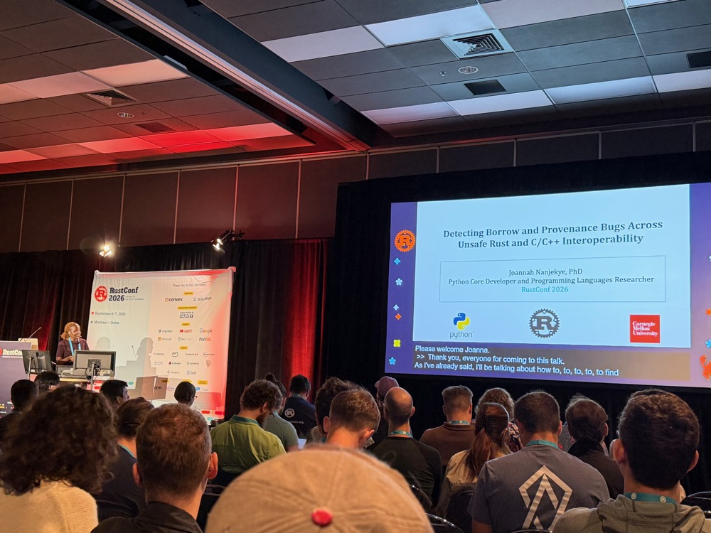

Joannah Nanjekye focused on failures that become possible when Rust's guarantees meet unsafe code, raw pointers, and C/C++ interfaces. The important distinction was between an ordinary memory-access error and a violation of Rust's aliasing or provenance rules. An access can be problematic for reasons that are not captured simply by asking whether its address is inside a live allocation.

The session compared byte-level memory instrumentation with semantic execution techniques that track provenance, initialization, and language invariants. It also covered ownership-aware instrumentation that concentrates on higher-risk pointers, and dynamic provenance tracking intended to expose borrow-permission violations introduced across foreign-code boundaries.

For me, the useful result is a more precise way to discuss tooling coverage. Different techniques answer different questions, with different costs in precision, performance, and deployability. In a mixed-language system, I want to know which invariants a particular tool actually checks, rather than treating every memory diagnostic as interchangeable.

### From C++ APIs to Idiomatic Rust: Wrapper Design Patterns

By Divya Chakarwarti

Divya Chakarwarti addressed the next problem after generating bindings: designing the Rust API that people will actually use. The session worked through ownership and lifetimes, translating error handling into `Result`, defining safe abstraction boundaries, and keeping the unsafe surface small.

The examples and review topics included `Send` and `Sync` assumptions, ABI and layout hazards, panic and exception boundaries, accidental copies, and performance regressions introduced by the wrapper itself. Generated bindings, including Crubit-style approaches, can accelerate the mechanics of interoperability, but they do not make all of those design decisions disappear.

The distinction I would keep is that bindings are not the same thing as an API. A wrapper has to express the guarantees the Rust caller can rely on, not merely expose the operations the C++ implementation happens to provide. That is where safety, ergonomics, and long-term maintainability meet.

### Unsafe Rust

By Robert C. Seacord

Robert's session took the discussion down to the specification level. It examined unsafe Rust, undefined behavior, library invariants, and the gaps that remain when low-level code depends on semantics that are not fully specified.

The presentation's proposed a path toward a more rigorous foundation. The connecting idea was to make the language's operational behavior and the obligations of unsafe code precise enough to reason about, particularly in safety-critical software.

I put this alongside the interoperability and instrumentation sessions: detecting an error and stating precisely why it is an error are related but different jobs. Tools, specifications, and library-level invariants need to reinforce one another. 

### Rust Interop Initiative Sync (Study Group)

I joined the Rust Interop Initiative study-group on Wednesday afternoon. This was a working discussion with binding-tool maintainers and people dealing with the compiler and linker side of interop, moving from project updates to two bigger questions: useful overloading support and a dependable contract for foreign linkers.

The open-mic updates exposed maintenance problems alongside the technical work. Yuri described a bindgen wrapper for more idiomatic naming and enum re-exports, with a related upstream pull request that had reportedly waited about a year without a response. Joel Marcey took an action to find out who was reviewing and merging new bindgen features. Having a proposed implementation is not enough if there is no clear path to getting it upstream.

The Zngur update covered template-style type definitions, C++ enum fields, trivially relocatable types, Windows support, and platform-specific configuration. An important distinction was that Zngur did not require nightly Rust or a particular C++ compiler. Crubit's Rust-to-C++ binding direction was reported as open source, with the reverse direction targeted for the end of 2026. Bazel support was already there, while Clang was the C++ frontend being targeted and moving to stable Rust remained a goal. That led to an action for Teor to arrange a focused discussion with the Rust language and compiler teams about stable-toolchain support.

Ian's BorrowSanitizer update emphasized upstreaming the work and testing more code. He also raised making Clang available alongside the Rust toolchain as a practical improvement. That was another example of the gap between having a promising interop tool and making it straightforward to use against real mixed-language projects.

The main language-design discussion was about the "splat" overloading experiment. The idea is to package a call's arguments into a tuple and combine that with traits to express overloads. The initial compiler experiment was implemented as an incomplete nightly feature, with companion macros generating the traits needed for overloaded functions and methods. It builds on existing trait machinery rather than introducing an entirely separate overload-resolution order. No interop tool had adopted the experiment yet, so its usefulness still needed to be tested against real APIs.

The debate was about where to draw the line between useful same-name overloads and the much wider machinery of C++ lookup, including ADL. I pointed to string conversions as a substantial use case, while recognizing that they do not cover the whole C++ problem. We turned that into a concrete follow-up I helped propose: try the experiment against the constructors in the C++ standard library and see whether it could support roughly 90% of them. For me, that was the useful turn in the discussion: a testable question about real API coverage, rather than only an argument about overloading in the abstract.

The final part focused on foreign linkers and Adam Casey's RFC 3993. Matt had raised platform-specific issues involving weak linkage, provenance and LTO, and pre-main initialization code being lost to dead-code stripping. The RFC discussion focused on what an external build system needs to know to link Rust code reliably. Taylor argued for a stable `rlib` format and a clearer toolchain contract covering standard-library sub-crates, native and runtime dependencies, `no_std` variants, allocator choices, and panic strategies. The question was not just how to package an archive, but how to make the dependencies and retention requirements explicit.

My takeaway was that interop needs more than a binding generator. It needs maintained upstream projects, evidence from real API shapes, and clear contracts for the surrounding toolchain. The concrete next steps were investigations and experiments, not a declaration that the language-design or linker questions were settled.

Teor also published a [summary report](https://rustfoundation.org/media/rust-cpp-interop-initiative-progress-update/) of recent work in this space. Have a look for other details/updates.

### 🎉 Evening Reception: Celebrating 10 Years of RustConf

We wrapped up the day with the evening reception celebrating 10 years of RustConf. This was the social part of Wednesday's program with appetizers, drinks & chats. 

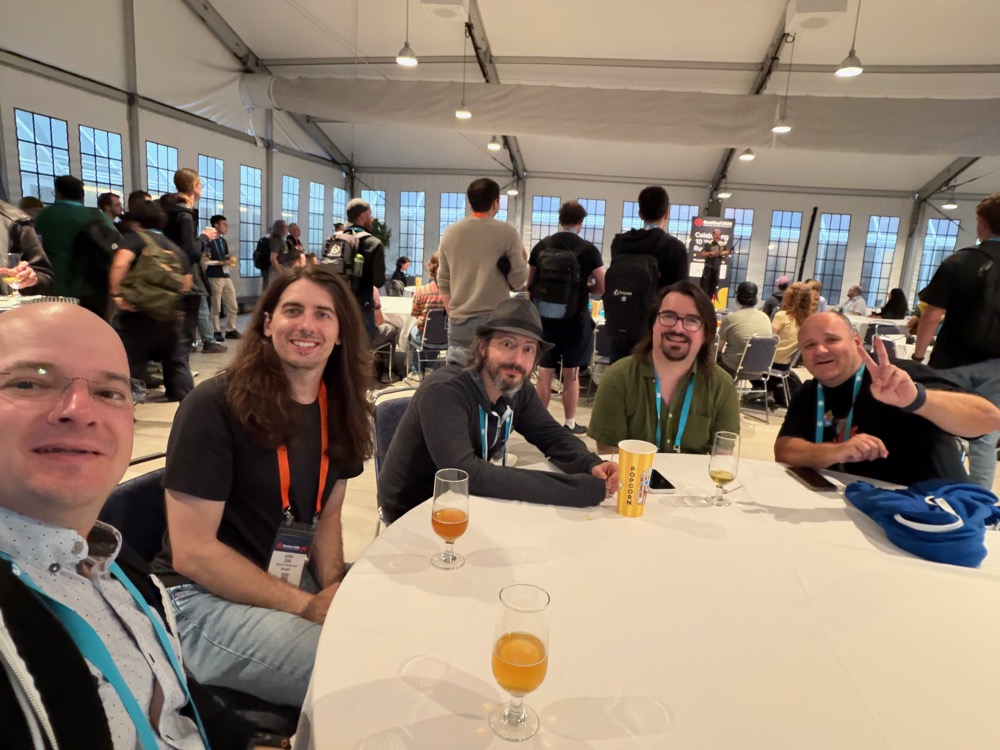

## Thursday, September 10

**Day 2** started with renewed energy:

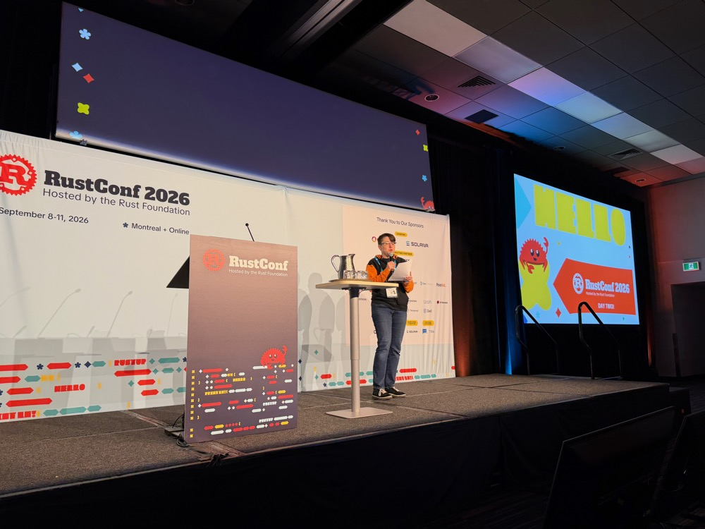

### Keynote: Rust, In Sickness & In Health

By Bryan Cantrill

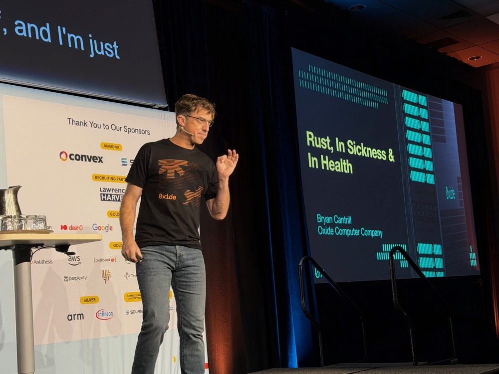

Bryan Cantrill opened Thursday with a longer-term view of Rust adoption: what it means to build a company around a language and then live with that decision for years. His keynote drew on the 7 years since the start of Oxide Computer Company, moving beyond the initial Rust enthusiasm to the strengths, gaps, and tradeoffs that become visible in sustained use.

The breadth of that experience was central to the talk. Bryan described Rust being tested across bootloaders, an operating system, a hypervisor, distributed storage, networking, compilers, and debuggers. This was not a case study confined to a single service or a narrow rewrite.

I see the keynote as a useful counterweight to the usual adoption announcements. The deeper question is what a language and its ecosystem need to prioritize once they are already carrying a substantial system. A successful initial choice does not remove the need for honest discussion about the gaps that remain.

This is a must-watch when it comes online: part standup comedy, part wisdom from decades of experience in systems programming. A highlight of the conference for me! 

### Project Update: The Safety-Critical Rust Consortium Two Years In

By Pete LeVasseur

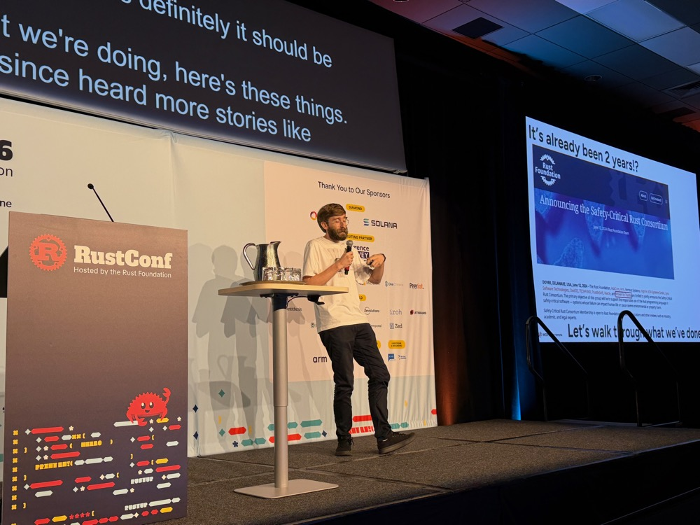

Pete gave an update on the Safety-Critical Rust Consortium. It covered the work completed so far and the remaining obstacles to using Rust in more demanding safety-critical domains.

The consortium is also working on the regulatory and compliance requirements that surround safety-critical software. Improving code quality and assembling the evidence needed for a particular deployment are connected, but they are not the same task.

### Project Goals : Funding : Chocolate : Peanut Butter

By Nicholas Matsakis

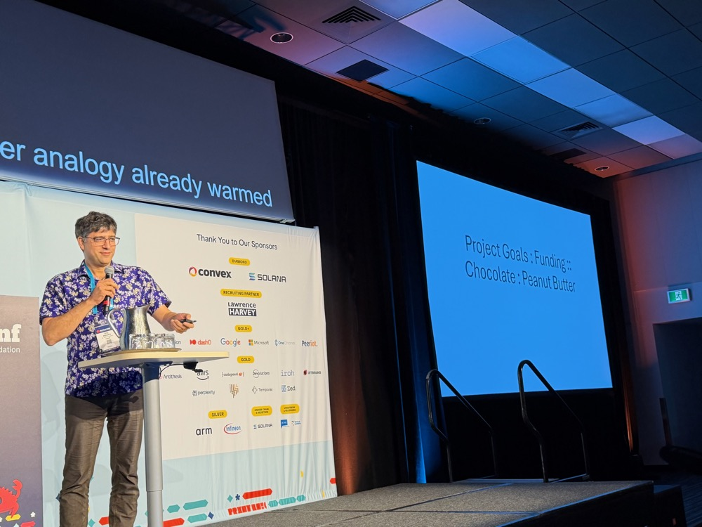

Niko connected two things that need to work together as Rust grows: a shared set of project goals and a sustainable way to fund the people doing the work. The update described how the Rust Foundation and Rust Project are trying to turn demand for Rust into support for both routine maintenance and important development priorities.

The concrete mechanisms included the Maintainer Fund, the Maintainer-in-Residence program, and the Project Goals process. I see the important point as _alignment_: funders, maintainers, and users need a way to agree on what matters and make the work sustainable. Popularity alone does not perform maintenance or turn an agreed priority into engineering capacity.

### Google: How We Replace Common C⁠ and C++ Libraries with Rust at Scale

By Maria Pospelova

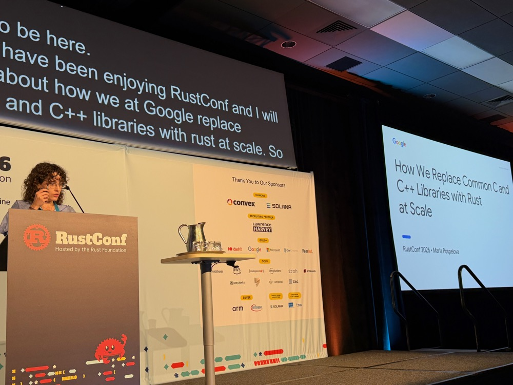

Maria Pospelova described Google's work on replacing common C and C++ parsing and decoding libraries with Rust alternatives. Image and audio handling provided the motivating examples: widely used functionality where memory-safety vulnerabilities make the implementation choice consequential.

The adoption pattern was concrete. Rust supplies the implementation, Crubit exposes a C++ interface, and existing call sites are changed to use that alternative. Maria used a wrapper around `image-rs` as an example of the approach.

A second part of the migration story is an extensible *toolchain* for translating C/C++ to Rust, distinct from Crubit's role at the interface boundary. Introducing **RustShift**: the AI-driven and human-in-the-loop workflows, differential fuzzing, and formal verification. 

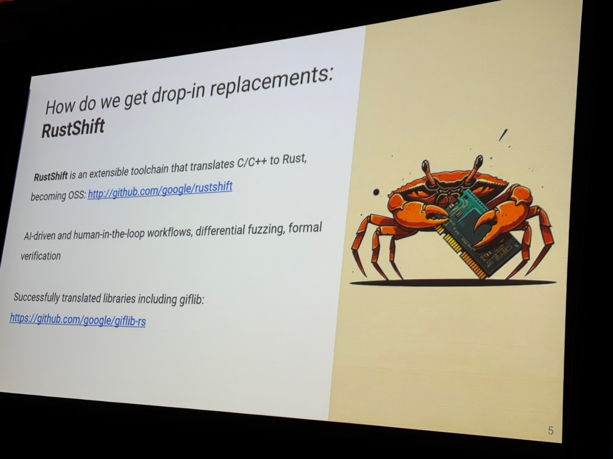

The choice of migration boundary matters: the useful unit is not necessarily an entire application. It can be a well-defined library interface through which an existing C++ system starts using a Rust implementation. That makes wrapper design and interface compatibility part of the migration strategy, not cleanup work to do afterwards.

### Verifying the Rust Standard Library: A Year of Proofs, Tools, and Winners

By Felipe Monteiro

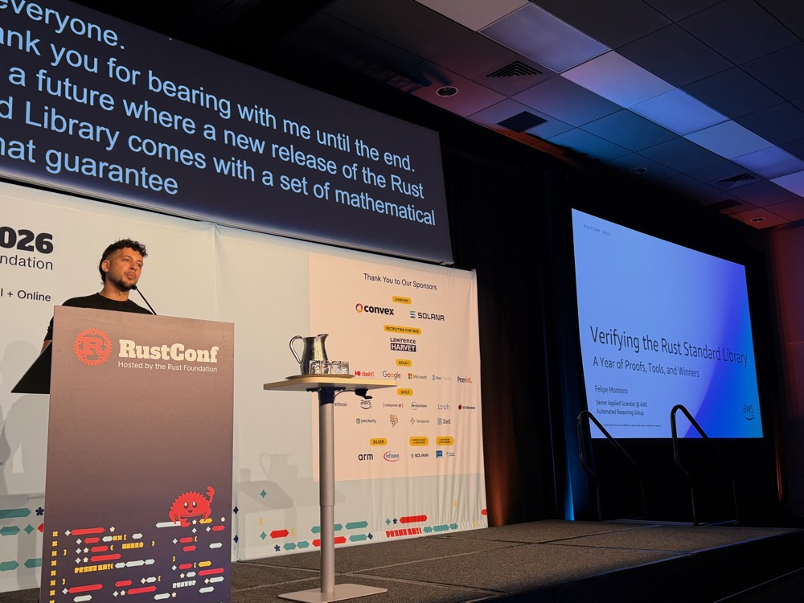

Felipe Monteiro presented an update on the community effort to verify properties of the Rust standard library. The reported progress included more than 11,000 functions machine-proved free of key memory-safety violations, alongside work on generating proof harnesses and broadening participation.

The session also covered experimental function contracts and a verification effort spanning tools such as Kani, VeriFast, ESBMC, and Flux. 

The scale is interesting, but I would keep the scope of the claims explicit: these are proofs of particular properties, not a blanket statement that every behavior of the entire standard library has been verified. The encouraging part is the combination of reusable tooling, concrete verification targets, and a contribution model that lets industry, academia, and open-source maintainers make progress together.

### BorrowSanitizer: Securing Rust Across Foreign Function Boundaries

By Ian McCormack

Ian McCormack presented **BorrowSanitizer** as a dynamic bug-finding tool for Rust/C++ applications. The target is a class of failures that can appear when unsafe code or a foreign call violates Rust's aliasing assumptions, producing behavior that can be difficult to reconcile with a source-level reading of the program.

Ian positioned this work against the limitations of existing approaches, including Miri's overhead and limited foreign-function support in multilanguage applications. BorrowSanitizer is being developed to detect violations of the Tree Borrows aliasing model across those boundaries.

This connected directly with Joannah Nanjekye's earlier session. Safe wrappers still need evidence that the operations underneath them respect the promised invariants. For me, the interesting question is how much of that evidence can be obtained from realistic mixed-language executions, rather than only from isolated Rust code.

### Beyond the &: A Future for Native Smart Pointers in Rust

By Tyler Mandry

Tyler explored a tension in Rust's library-first design: built-in pointer types such as `&`, `&mut`, and `Box` receive support from the language and borrow checker that ordinary library types cannot fully reproduce. That affects the ergonomics and expressiveness of types like `Arc`, `RefCell`, and complicates patterns such as safe in-place initialization.

The talk investigates potentially exposing more of the underlying primitives to library authors. The possibilities discussed included reference forms such as `&own` and `&uninit`, with the aim of making a wider range of pointer and wrapper types integrate naturally with Rust's model. 

The interesting part is the connection between language primitives and library design. Types such as `VolatilePtr` or `CppRef`, and wrappers such as `Cell` or `MaybeUninit`, point to needs that span hardware access, interoperability, and ordinary systems programming. The question is how to express those needs without repeatedly falling back to awkward or unsafe interfaces.

### Fireside Chat - Stewarding Rust & Python

By Rebecca Rumbul and Deb Nicholson

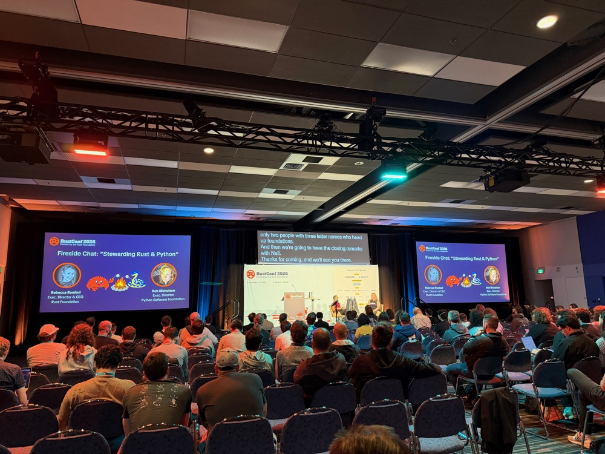

Rebecca Rumbul and Deb Nicholson closed the main conference's technical program with a conversation about stewarding Rust and Python. The topics included AI's impact on language ecosystems, interoperability between communities, security priorities, governance, and leading large open-source projects through change.

## Friday, September 11

### UnConference

Friday included the traditional UnConference, with a different format from the scheduled talks: participant-led discussion rather than a fixed sequence of presentations.  

Its role was to create room for people to bring their own questions and discuss them with other Rust users, rather than fit every topic into a prepared talk. 

### Rust Foundation Member Summit

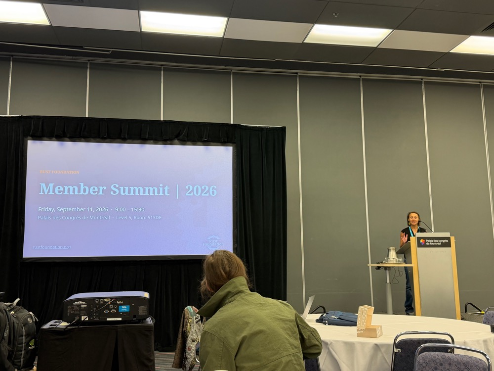

I also attended the Rust Foundation Member Summit, a dedicated forum for members to engage with Foundation leadership and one another. The program combined updates, roundtable discussions, and open conversations about Rust adoption, the wider ecosystem, funding, and sustainability.

The Rust Adoption _fishbowl_ made those topics concrete through questions about each organization's adoption story, developer-workflow pain points, AI's effect on development, safety-critical and embedded work, and what would accelerate adoption.

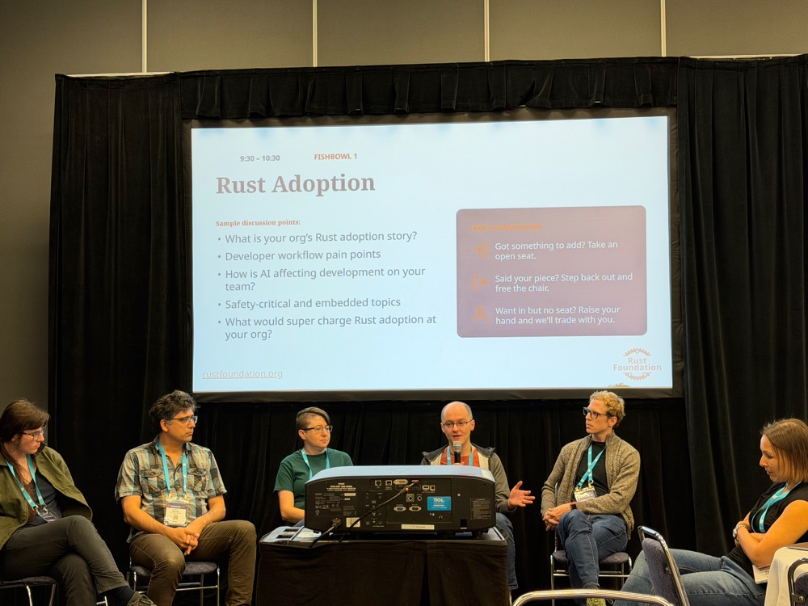

The Funding & Sustainability fishbowl posed a different set of questions. A hypothetical doubling of the Foundation's budget was the starting point for asking where the next dollar should go. Other prompts asked what would improve crates.io's long-term sustainability and which supply-chain risks worried member organizations most. 

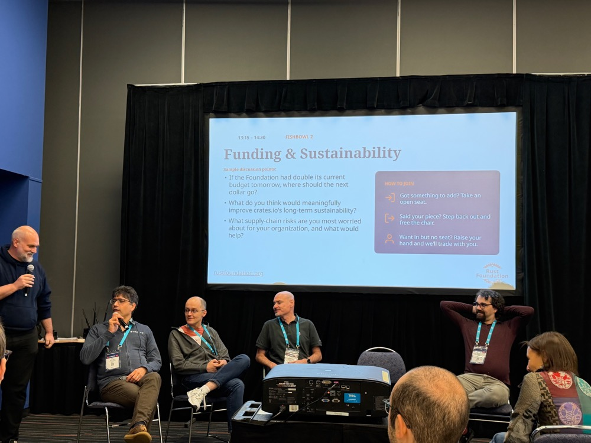

This brought the organizational side of several conference themes into the foreground: how adoption priorities become shared work, how that work is supported, and where members can collaborate rather than tackle the same problems independently. 

## Common themes across the conference

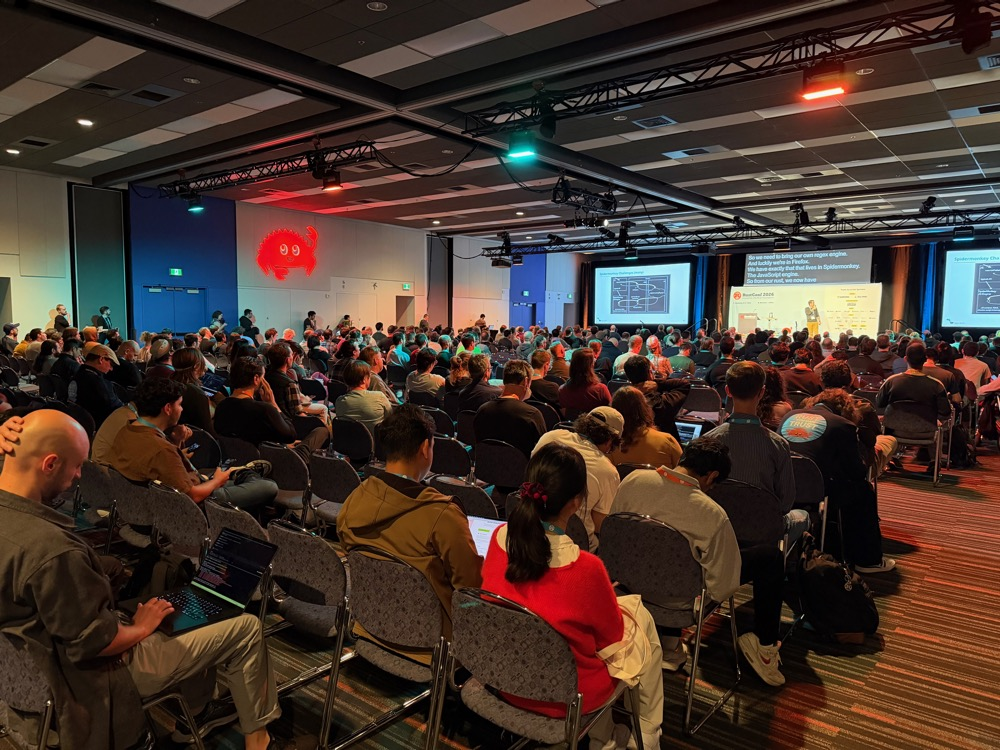

Stepping back, across the program some recurring themes stood out:  

**Production adoption and engineering maturity** framed Rust as infrastructure to operate and support over many years, with the Ubuntu, Oxide Computer, and Volvo sessions connecting adoption to reliability, tooling, integration challenges, and organizational change.

**Interoperability and incremental migration** were central to that story: many sessions emphasized fitting Rust into established systems through safe boundaries, usable APIs, and cooperation with existing maintainers.

**Safety and correctness beyond the borrow checker** connected unsafe-code semantics, pointer provenance, BorrowSanitizer, standard-library verification, and safety-critical requirements; AI-assisted coding and translation added urgency to validating generated changes through review, testing, benchmarks, and equivalence proofs, using tools for formal verification.

**Performance across CPUs, GPUs, and constrained devices** brought together profiling, observability, async execution, zero-copy parsing and I/O, scientific computing, ML runtimes, and embedded systems, with attention to both efficient execution and abstractions that make hardware complexity manageable.

Finally, **the sustainability of a maturing ecosystem** linked maintainer funding, project priorities, governance, security response, education, and community growth, from Project Goals and the Foundation Member Summit.

For our engineering teams, the common implication is that adopting Rust successfully requires more than choosing the language: it also requires deliberate investment in integration, validation, performance feedback, and the people and infrastructure that keep the ecosystem dependable.

## My own time in the spotlight

### Microsoft: Rust (in production) Without Fear

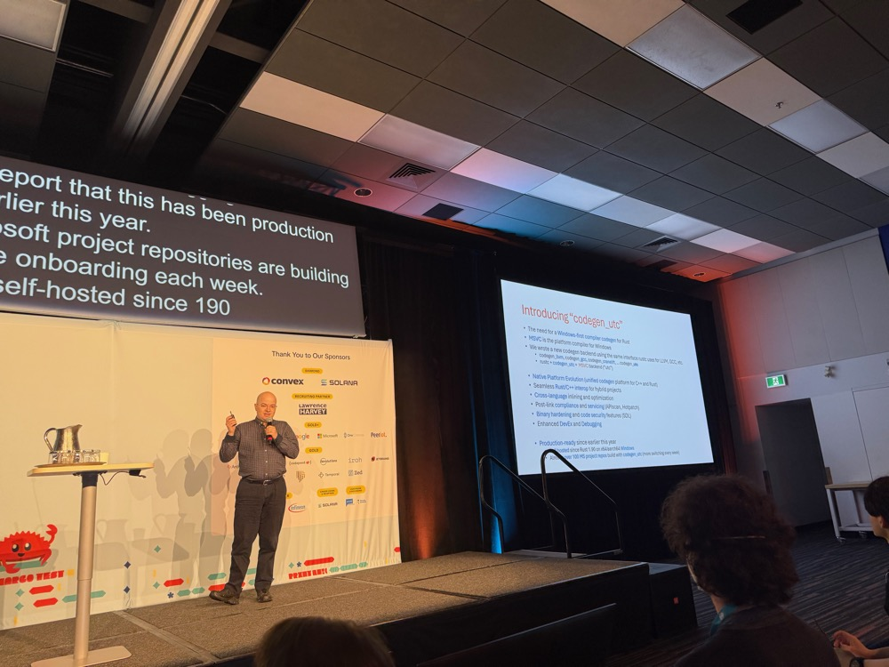

Thursday, I presented **Rust (in production) Without Fear**, a quick update covering the engineering systems, tooling, and compiler work behind production Rust at Microsoft. The two main messages were that **Rust is now a Tier-1 Language at Microsoft** and the announcement of **`rustc_codegen_utc`** codegen backend for rustc.

#### Rust is now a Tier-1 Language at Microsoft

This was a milestone in Microsoft's support for internal development: Rust now sits alongside C++, C#, and TypeScript among our best-supported languages. I described the work needed around Windows ecosystem compatibility, developer tooling and workflows. Rust also had to become part of the engineering systems and workflows around secure supply-chain builds, compliance, and SDL requirements on both Windows and Linux.

#### Announcing rustc_codegen_utc

The second announcement was our Windows-first code-generation backend for Rust - `codegen_utc`. It plugs into the same `rustc` backend interface used by LLVM and other backends, connecting rustc to MSVC code-generation backend (`UTC`). The motivation is a common code-generation platform for Rust and C++ on Windows target, enabling interoperability in hybrid projects, cross-language inlining and optimization, post-link compliance and servicing, binary hardening, and better debugging on Windows.  

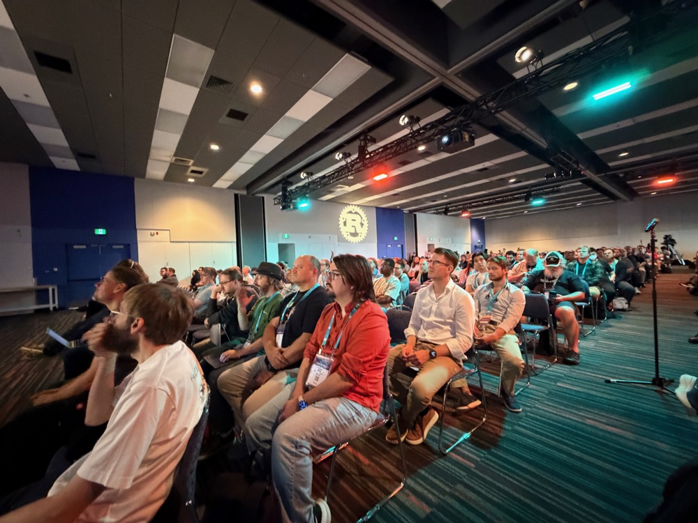

# Bye, Montreal ✈️

See you all at RustConf **2027**, in Vancouver 🇨🇦 

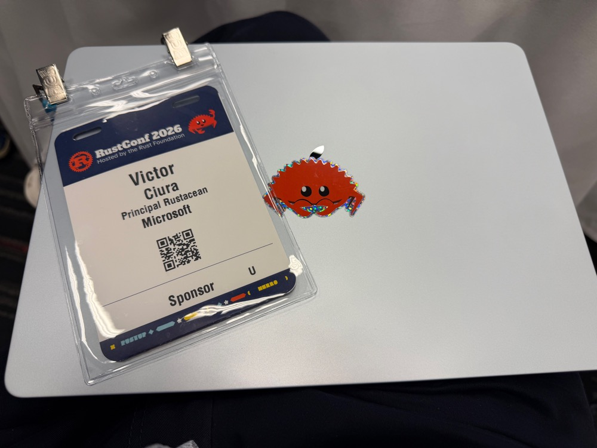
