# RustWeek & Rust Project All-Hands 2025 Trip Report

Several folks from Microsoft attended this year’s **RustWeek** in Utrecht, Netherlands.  

RustWeek was both a conference for the Rust programming-language community **and** the first Rust Project **All-Hands** since 2019. The event was well attended by users of the language and many project core contributors. The week included two days of talks, one day of workshops, a hackathon, and social activities all week.

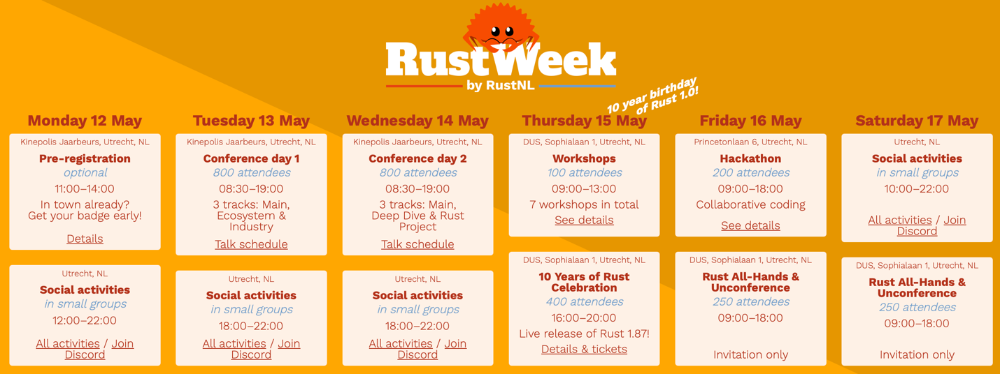

---

## MS Attendees

### DevDiv Rust Team
- Eric Holk  
- Wesley Wiser  
- Nastia Mozgunova  
- Katerina Prusova  
- Jakub Dupak  
- Victor Ciura  

### Microsoft Rustaceans
- Nell Shamrell-Harrington  
- Boqun Feng  
- Yosh Wuyts  
- Arlo Siemsen  
- Nate Deisinger  
- Berkus Karchebnyi  
- Katerina Churanova  
- Eralp Erat  
- Dima Birenbaum  
- Gustavo Gimenez  
- Mauricio Castaneda Melendez  

---

## The Numbers

| Day(s) | Event | Attendance |
| --- | --- | --- |
| Tuesday / Wednesday | Conference | **840** attendees |
| Thursday | **Rust 🥳 10‑Year Celebration** | **350** attendees |
|  | Workshops | ??? students |
| Thursday – Saturday | All‑Hands | **153** people (Rust Project members & leads, invited WG21 C++ friends) |
|  | UnConf (same building, same time) | **100 +** people |

---

## The Conference

The week started with the conference itself, which gathered **over 800** attendees from all over the world. The schedule was packed with short‑form and long‑form presentations, running in **three parallel tracks** each day. In some time‑slots it was hard to decide which room to go to.

### Venue

Speaking of rooms, the venue for this conference was… **a cinema multiplex 📽️**  
<https://rustweek.org/kinepolis/>

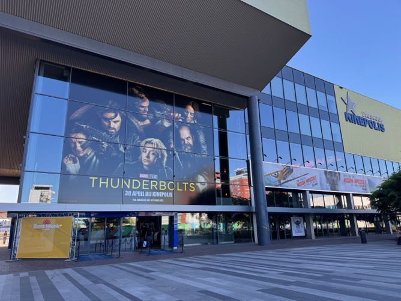
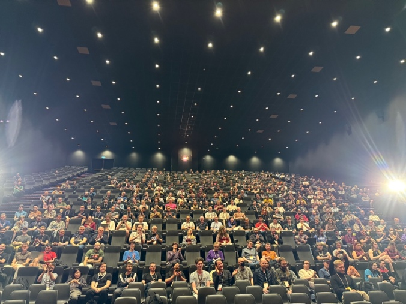

This unusual “conference‑room” setup makes for a memorable viewing experience.

*On the plus side*, nobody complains about poor projector quality (I’m looking at you, speakers that love black‑background slides!) or yells that the code font is too small.  

*On the negative side*, the cinema seats are **way** too comfortable—if you’ve travelled from far away and jet‑lag hits you hard in the afternoon 😅

The Rust 🍿 movie posters adorning the cinema walls were hilarious. Kudos to Mara!

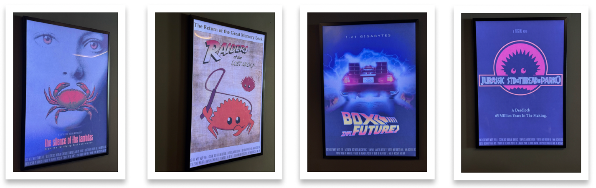

> **Here’s a PDF with all of them:** *RustWeek Cinema Posters.pdf* if you want a laugh.

### Keynote

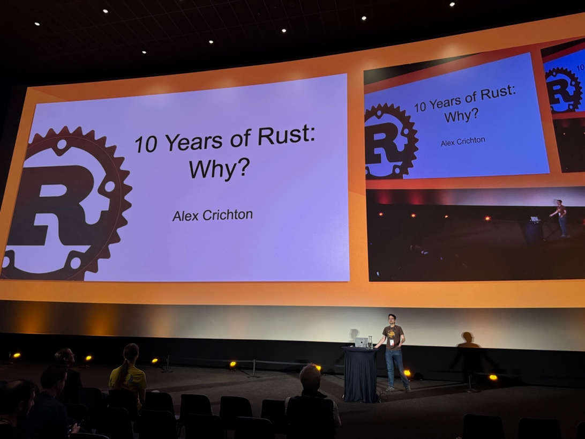

Rust‑team alumni **Alex Crichton** (Core, Cargo, Libs teams) delivered a poignant and insightful keynote, reminiscing about Rust’s beginnings (pre‑1.0), the great decisions made, the early experiments, and the emergent community he saw many years ago.

### The Tracks

The conference schedule featured multiple parallel tracks to choose from:

- **Main track** – 16 talks that covered a variety of topics and had something for all audience levels, from beginners to advanced.  
- **Ecosystem track** – hosted a mix of talks by selected communities in the Rust ecosystem, chosen by each *Unconf* group (e.g. Bevy, Rust Embedded).  
- **Industry track** – dedicated to decision‑makers exploring the adoption of Rust in their organizations.  
- **Expert tables** – three inspiring talks and two rounds of expert tables.  
- **Deep‑dive track** – advanced, in‑depth talks selected from the CfP.  
- **Rust Project track** – talks by the core teams of the Rust project.

### Hallway Track

As always at conferences, we don’t just go for the sessions. The best track is actually the **“hallway track”** 🙂 

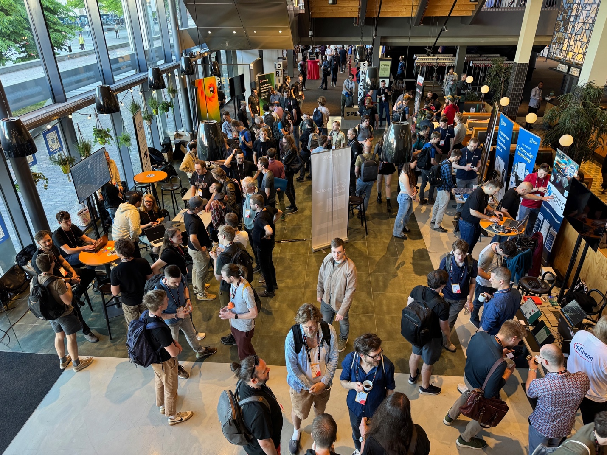

That’s where the magic happens: people from all corners of the world come together, meet, reconnect, and chat about their work, cool projects, and the tech news of the day.

For some of us Microsoft Rustaceans, it was the first time we’d seen each other outside of the dreaded Teams UI 🙃

### Favorite Sessions

Here are our favorite picks from the fabulous conference program (look out for them when they come online on YouTube):

- *Floating Point Hashing* – **Rose Peck**  
- *Corrosive C – Compiling Rust to C to target new platforms* – **Michał Kostrubiec**  
- *Live Recording of 🎙️ ‘Rust in Production’* – **Matthias Endler & Niko Matsakis**  
- *Everything You Should Know About the Compiler Frontend* – **Michael Goulet**  
- *What it’ll take to eradicate unintended breakage from Rust* – **Predrag Gruevski**  
- *Atomic break down: understanding ordering* – **Ciara R**  
- *The State of Const Generics* – **Boxy UwU**

### Expo

As usual, the conference offered sponsors and exhibitors a generous area for booths, demos, and audience interaction. Conference swag was filling backpacks quickly.  

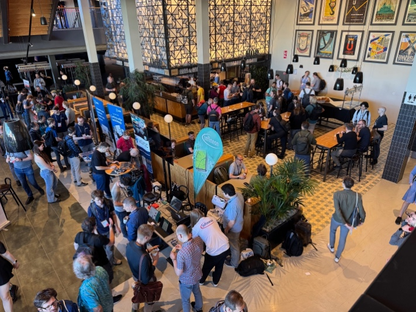
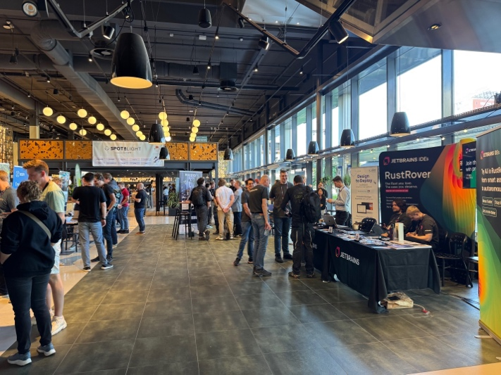

### Organizers

The conference ran without any snags and everyone enjoyed themselves. **Kudos** to the organizers, volunteers, and speakers who made this event a success. Thank you, all!

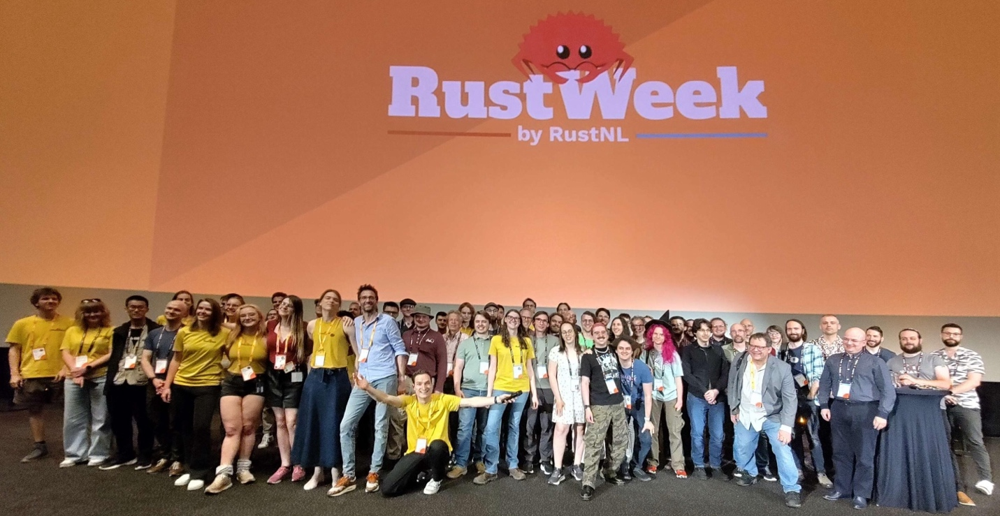

---

## 10‑Year Celebration 🎂

**10 Years of stable Rust! 🎉** Can you believe it?

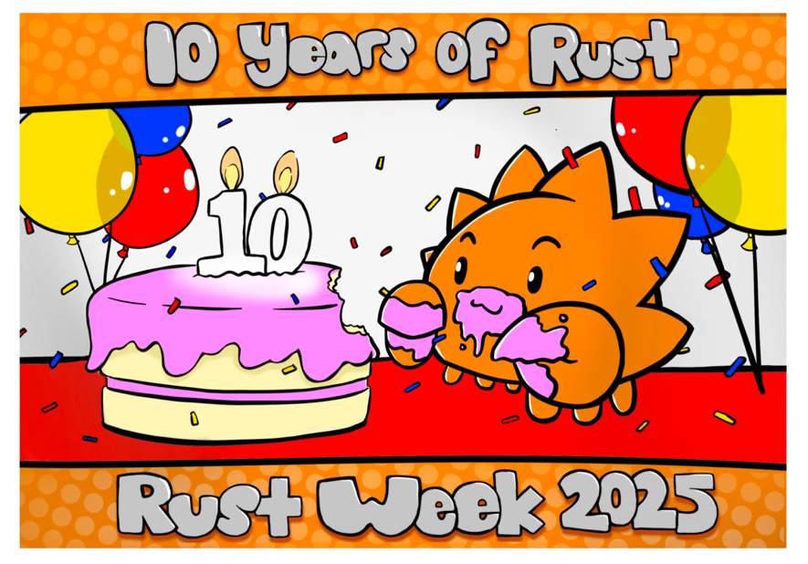

We gathered to celebrate this milestone:  

Rust Project alumni and current team leaders took the stage to share Rust stories that shaped them. The event was emceed by our very own **Nell Shamrell‑Harrington**. It featured short talks by team members, alumni, and friends: **Alex Crichton, Aria Desires (aka Gankra), Niko Matsakis, Guillaume Gomez (aka imperio), Jonas Boettiger (aka joboet), Alice Ryhl, Bec Rambul, Esteban Kuber**.

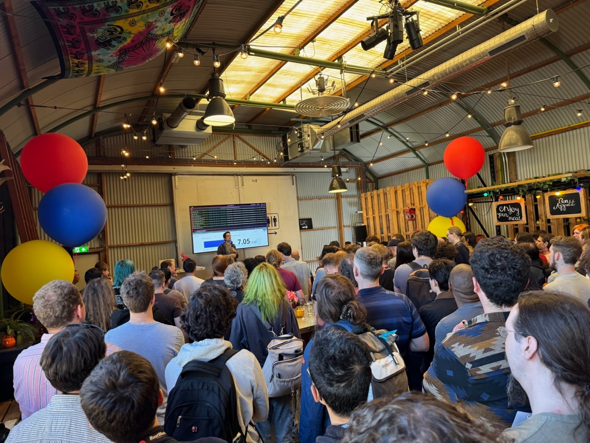

Also, read this anniversary blog‑post from **Graydon Hoare** about the beginnings, the Rust journey, and project goals:  
<https://rustfoundation.org/media/10-years-of-stable-rust-an-infrastructure-story/>

Boasting with confidence, we decided to **launch v1.87 live on stage**, during the party.

> **Here’s Pietro pushing the red button:** *(photo)*

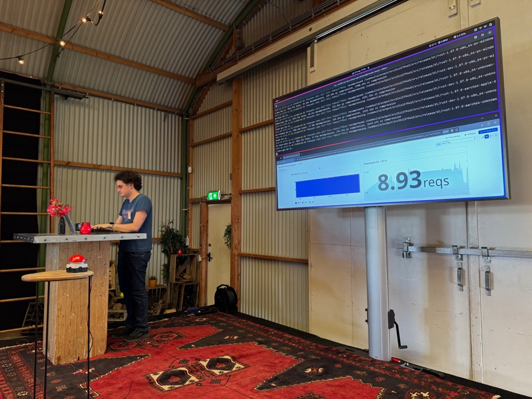

Two hours… many drinks & stories later and **Bam!** we had a release built and deployed 🚀

---

## Workshops & UnConf

The **RustWeek Unconference** was an invite‑only event for Rust maintainers. The goal was to facilitate maintainers working together in person, fostering cross‑collaboration with other maintainer groups and with members of Rust project teams.

The unconference was for maintainers of:

- **Rust for Linux**  
- **Bevy Engine**  
- **Rust Embedded Working Group**  
- **UI, App dev & Browser Summit**  
- **Critical infrastructure**

### Thursday Workshops

- Let’s build our first **Bevy** game  
- Introduction to **Diesel**  
- Building a cross‑platform application in **Makepad**  
- **Clippy** Lint Implementer’s Workshop  
- Introduction to **Rust / Python Interop** with **PyO3**  
- **Rust CLI Tools:** Building a Fast File Finder  
- Building **Embedded GUIs** with Rust  
- **Memory Safety in the EU**

---

## Rust Project All‑Hands

This was the **first Rust Project All‑Hands since 2019**. The *invite‑only* event gathered members of the Rust Project and invited guests, including some members of the **C++ Committee (WG21)** for the Rust/C++ interop study group.

### Venue

<https://rustweek.org/dus/>

We were hosted at a wonderful venue, by one of Utrecht’s iconic canals. It had a great outdoor area for lunch and breaks and even sported a mini beach by the water. Yes, the Dutch spring weather was unusually nice, and the bold sun made us all look for safe shade by our laptops in the study‑group rooms 😎

### Study Groups

The following study groups were organized:

- **Lang**  
- **Libs**  
- **Compiler**  
- **Cargo**  
- **Cross‑team**  
- **Rustdoc**  
- **C++ Interop**  
- **WebAssembly**

The All‑Hands lasted **three days (Thursday–Saturday)**. In the main room, several one‑hour cross‑team sessions were held. Otherwise, each team or topic had its own room for collaboration, study, and presentations.

### Sessions / Agenda

#### Room: **C++ Interop**
- Bridging compilers for interop  
- Memory model standard shared between C++ and Rust  
- Interop‑inspired ISO C++ improvements  
- Reconciling Integer Types  
- C++ ⇄ Rust Debugging Story  
- Allow reuse of tail padding (aka C++’s “potentially overlapping subobjects”)  
- Concrete ways of reducing UB in the C++ spec  
- C++/Rust Interop Through WebAssembly Component Model  

#### Room: **Cargo**
- Coordinating Codegen Settings between Cargo and rustc  
- Cargo Lints: Learning from rustc and clippy  
- Inter‑project dependencies  
- XDG Paths  
- How should doctests function?  
- Consolidated Doctests and MSRV  

#### Room: **Compiler**
- A better LLVM IR for Rust  
- Adopting Rust at scale  
- Custom lint framework for Rust  
- Team processes and policies  
- Dynamic crates and on‑demand AST/HIR generation  
- GPU support in rustc  
- Contract attributes in rustc  

#### Room: **Cross‑team**
- Rust for Linux  
- Language Evolution Process in C++ and Rust  
- build‑std  
- Futile Feature Gates  
- Rust design goals  
- Cross‑team Build‑time Performance Roadmap  
- Rust Society  
- Rust Project and Rust Foundation  

#### Room: **Lang**
- Lang / Libs‑api: “Things we assume won’t change” / “Things we desperately want”  
- Function contracts and type invariants specification  
- Lang/Compiler collaboration process session  
- spec + lang team: integrate spec into project processes  
- Let’s talk about burnout  
- Fluidifying the feature lifecycle  
- Vision doc  

#### Room: **Libs**
- Stabilizing the Allocator API  
- **libc 1.0**  

#### Room: **Rustdoc**
- Rustdoc/Compiler: How to make rustdoc run all rustc passes  
- Dev‑tools (mdbook)/Docs.rs/Rustdoc: Integration of mdbook into generated documentation to allow having a guide alongside API docs  
- Improving search  
- Better use of wide space  
- Expanding macros in source‑code pages  

#### Room: **WebAssembly**
- **WASI 0.3** target support in the compiler (Wesley, Yosh)  
- Migrating the Rust ecosystem off **wasm‑bindgen** (Yosh, Alex, Till & Ryan from the Bytecode Alliance)  
- The path to “extern wasm” in Rust (Yosh, Alex, Till & Ryan from the Bytecode Alliance)  
- Caching Rust procedural macros using Wasm Components (Yosh, Bytecode folks, David Tolnay from Meta)  
- wasm components for native‑language interop (C++ room)  

### Microsoft Participation

Microsoft engineers participated in the following study groups, driving conversations on the topics listed above.

| Study Group | Participants |
| --- | --- |
| **Rust/C++ Interop** | Victor Ciura |
| **Compiler** | Wesley Wiser, Nell Shamrell‑Harrington |
| **Cargo** | Arlo Siemsen |
| **Cross‑team** | Eric Holk, Wesley Wiser, Nell Shamrell‑Harrington, Boqun Feng, Yosh Wuyts |
| **WebAssembly** | Yosh Wuyts, Wesley Wiser |

---

## That’s a wrap!

We all agreed we **shouldn’t wait another six years** to do this again, so we hope to see each other soon.

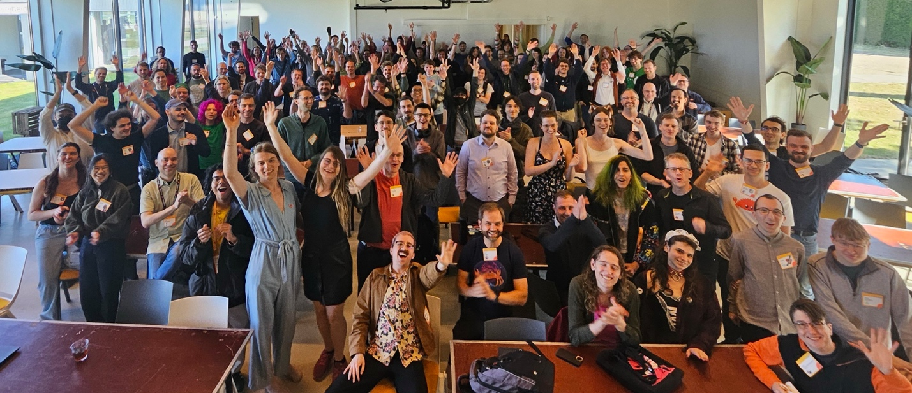

**It’s a wrap! <All‑Hands> up.**
