# RustWeek & Rust Project All-Hands 2026 Trip Report

Several folks from Microsoft were back attending **RustWeek** in Utrecht, Netherlands. Our second year with the same event formula and same location.

[RustWeek](https://2026.rustweek.org/) was both a conference for the Rust programming language community, as well as the Rust Project [All-Hands](https://2026.rustweek.org/events/all-hands/). The event was well attended by both users of the language and a lot of the project's core contributors. The week included two days of talks, workshops, a hackathon, working groups (Rust Project) and other social activities.

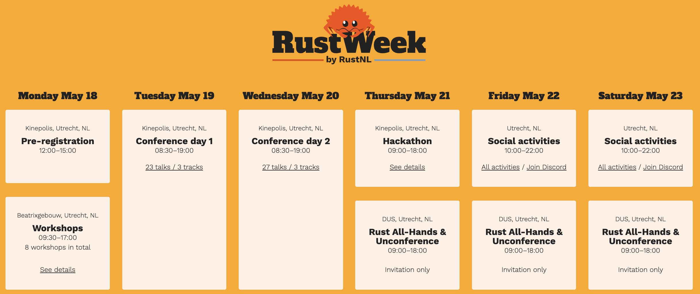

## The Numbers

Tuesday/Wednesday:

- Conference: **800+** attendees

Thursday-Saturday:

- All-Hands: ~**150** people (Rust Project members & leads + invited friends)

- UnConf (in the same building, at the same time): **100+** people

## The Conference

The week started with the conference itself, that gathered over 800 attendees from all over the world. The [schedule](https://2026.rustweek.org/schedule/tuesday/) was packed with short-form and long-form presentations, running in 3 parallel tracks each day. In some time slots, it was hard to decide what room to go to.

### Venue

Speaking of rooms, the venue for this conference was… a cinema multiplex 📽️ - same as last year:

[https://rustweek.org/kinepolis/](https://rustweek.org/kinepolis/)

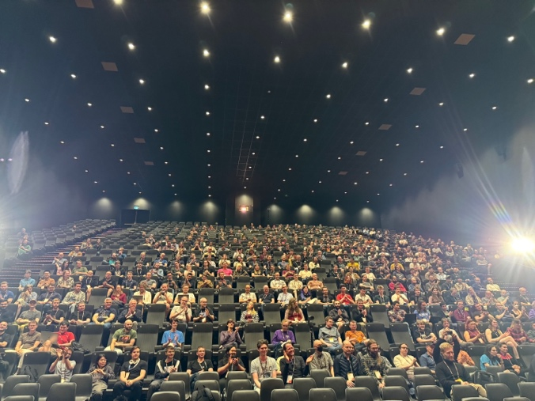 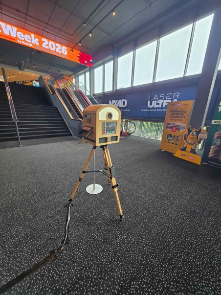

This unusual “conference room” setup makes for a memorable viewing experience.

On the plus side, nobody complains about poor projector quality (I’m looking at you, speakers that love black background slides!), or yell-out that the code font is too small.

On the negative side, the cinema seats are way too comfortable, if you’ve traveled from far away and jetlag hits you hard, in the afternoon J

The Rust 🍿 **movie posters** adorning the cinema walls, were even more hilarious than last years’. Kudos to Mara!

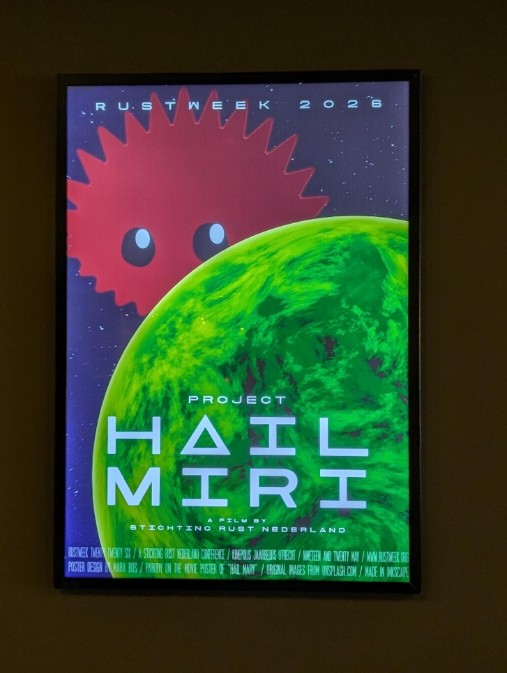 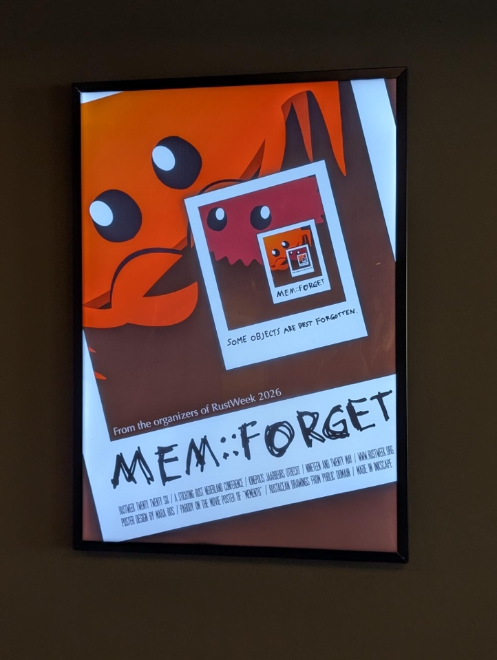

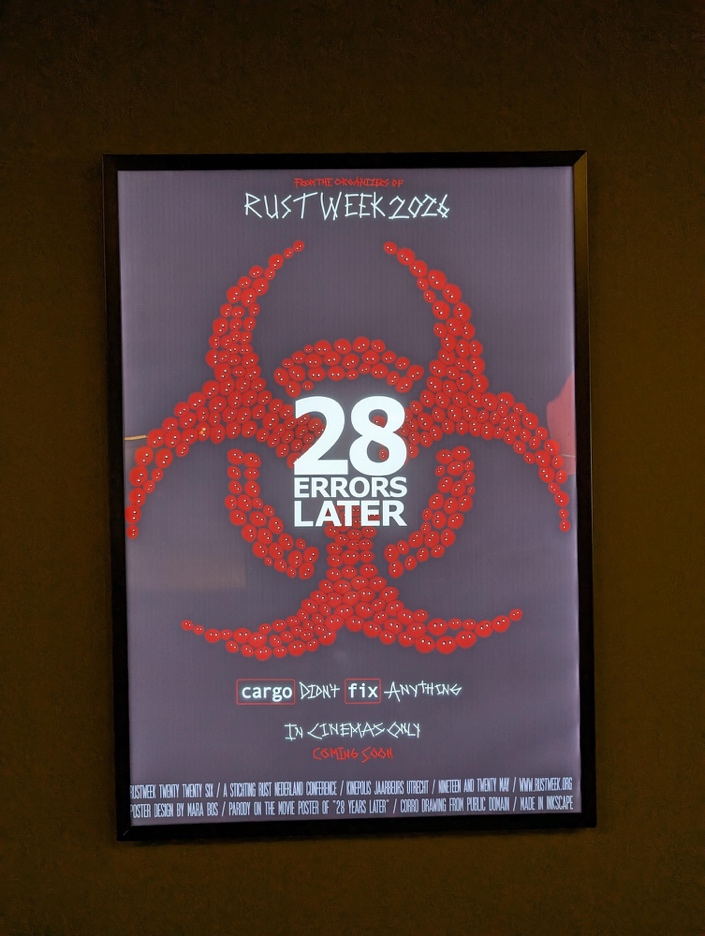 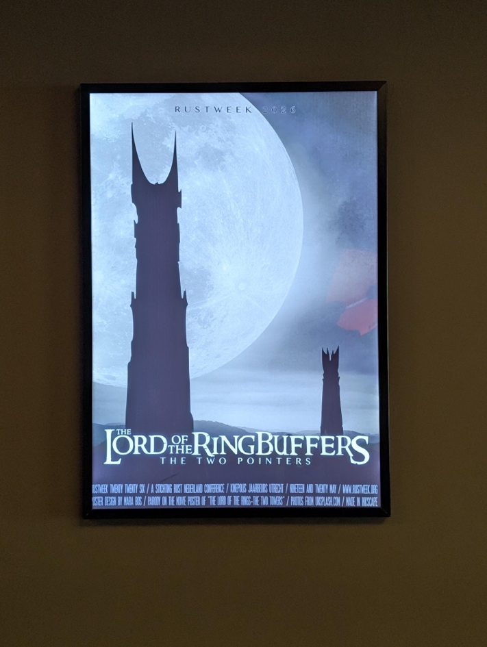

### The Tracks

The conference schedule featured multiple parallel tracks to choose from:

- **Main track** - talks that covered a variety of topics and had somethings for all audience levels, beginners to advanced

- **Industry track** - was dedicated to decision makers exploring the adoption of Rust in their organization

- **Compiler track** - had sessions on lang.next features, compilers, LSP and tooling

- **Applied Rust track** - offered case studies of Rust in unusual places/projects

- **Rust Project track** - offered talks by the core teams of the Rust project

#### Hallway Track

As always at conferences, we don’t just go for the sessions. The best track is actually the “hallway track” 😄

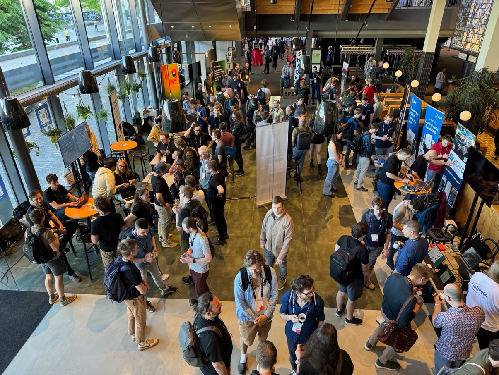

That is where the magic happens: people from all corners of the world come together, meet, reconnect, chat about their work, about cool projects and the tech news of the day.

### Favorite Sessions

Here are our favorite picks from the fabulous conference program. Look out for them when they come [online](https://www.youtube.com/@rustnederlandrustnl) on YouTube.

- [The Language of Empathy](https://2026.rustweek.org/talks/taylor/) - Taylor Cramer

- [One Language, Two IDE Engines](https://2026.rustweek.org/talks/ides/) - Lukas Wirth and Vlad Beskrovny

- [How we replace common C⁠(⁠+⁠+⁠) libraries with Rust at scale](https://2026.rustweek.org/talks/bastian/) - Bastian Kersting

- [Precise, consistent, and reliable code coverage](https://2026.rustweek.org/talks/jyn/) - Jynn Nelson

- [Common Pitfalls of Rewriting Things In Rust](https://2026.rustweek.org/talks/cliff/) - Cliff L. Biffle

- [Rust in Production: Oxidizing the Linux Kernel](https://2026.rustweek.org/industry) - Matthias Endler, Greg Kroah-Hartman, Alice Ryhl

- [FFI in Miri at 8000 segfaults per second](https://2026.rustweek.org/talks/nia/) - Nia Espera

- [Completion-based IO](https://2026.rustweek.org/talks/alice/) - Alice Ryhl

- [Field Projections: Making Custom Pointers feel Builtin](https://2026.rustweek.org/talks/benno-nadri/) - Benno Lossin and Nadri

- [Rewriting bors: how hard can it be?](https://2026.rustweek.org/talks/jakub/) - Jakub Beránek

- [Interop is the New Rewrite: Design Axioms for Rust's Next Frontier](https://2026.rustweek.org/talks/tmandry/) - Tyler Mandry

### Organizers

The conference ran smoothly and everyone enjoyed themselves. Kudos to the organizers, volunteers, and speakers who made this event a success.

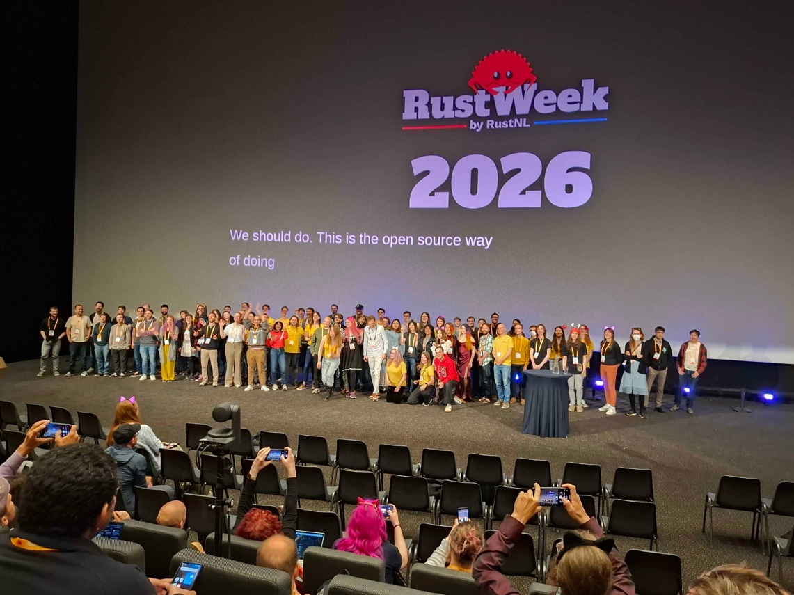

## Rust Project All-Hands

This was the *second* Rust Project All-Hands after the pandemic. The \[invite-only\] event gathered members of the Rust Project and invited guests, including some members of the C++ Committee (WG21), members of TC39 (JavaScript), and CPython community - for the Rust interop study group.

### Venue

[https://rustweek.org/dus/](https://rustweek.org/dus/)

We were hosted at the same wonderful venue as last year, by one of the iconic Utrecht canals. It had a great outdoor area for lunch and breaks and even sported a mini beach, by the water. Yes, The Netherlands Spring weather was unusually nice to us, and the bold sun made us all look for safe shade by our laptops, in the study group rooms J

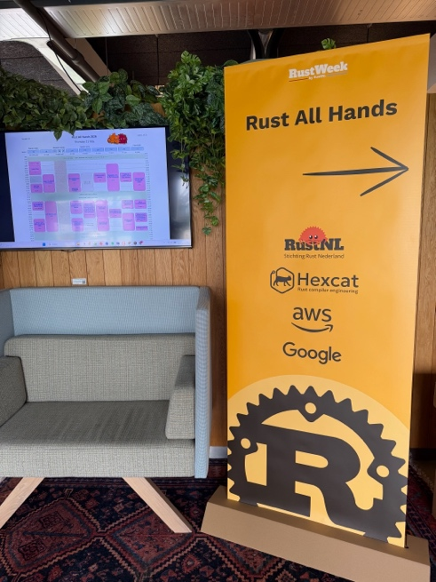 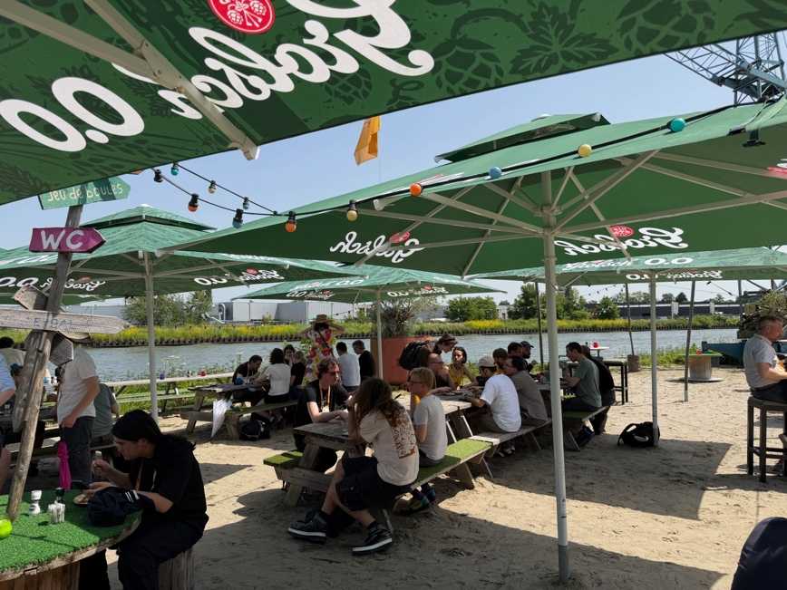

🚋 Tram study room 💻

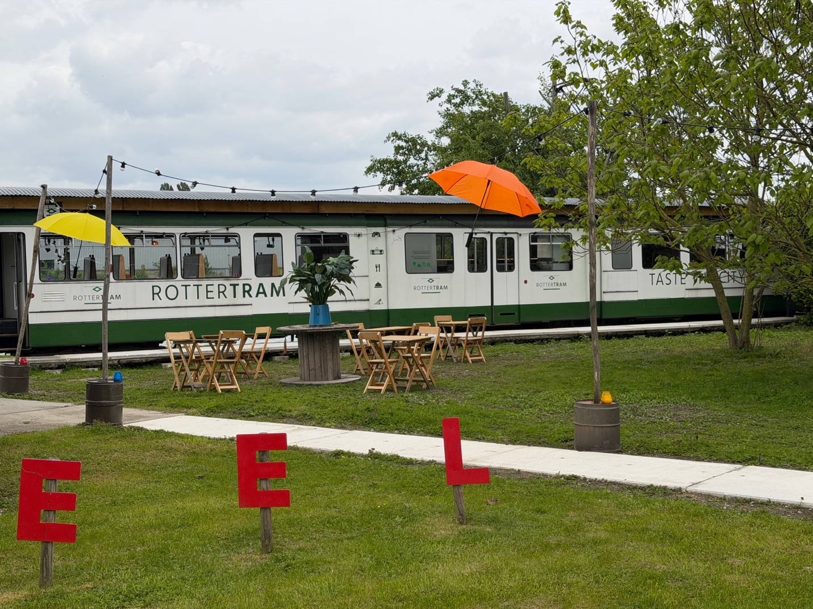

### Study Groups

The following study groups were organized:

- Lang

- Libs

- Compiler

- Cargo

- Cross-team

- Docs

- C++ Interop

- Tooling

- Infra

The All-Hands lasted 3 days (Thursday-Saturday). In the main room, several cross-team sessions were held. Other than that, each team or topic had its own room for collaboration, study, and presentations. Lots of ad-hoc discussions as well.

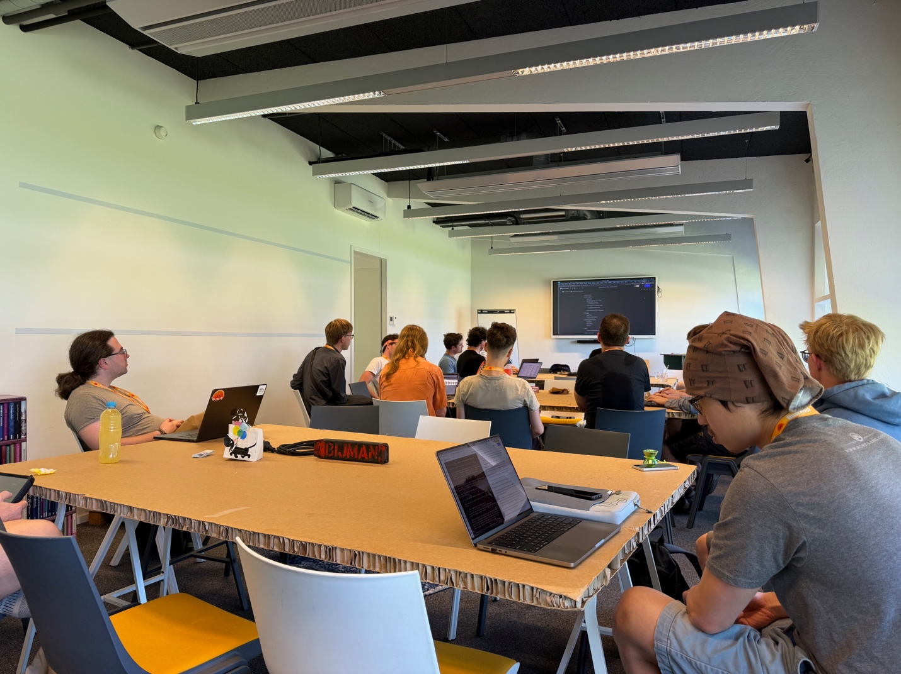

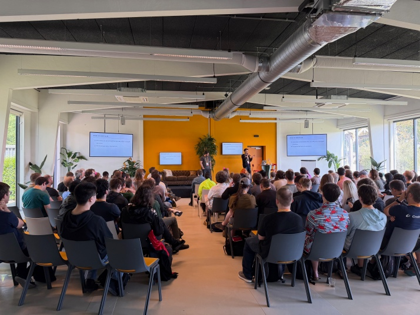 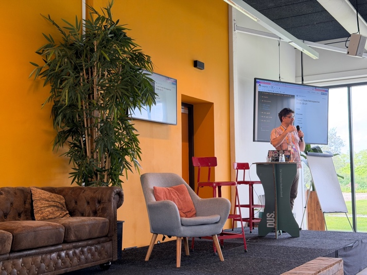

### All-Hands Agenda

Busy schedule in study groups, as usual:

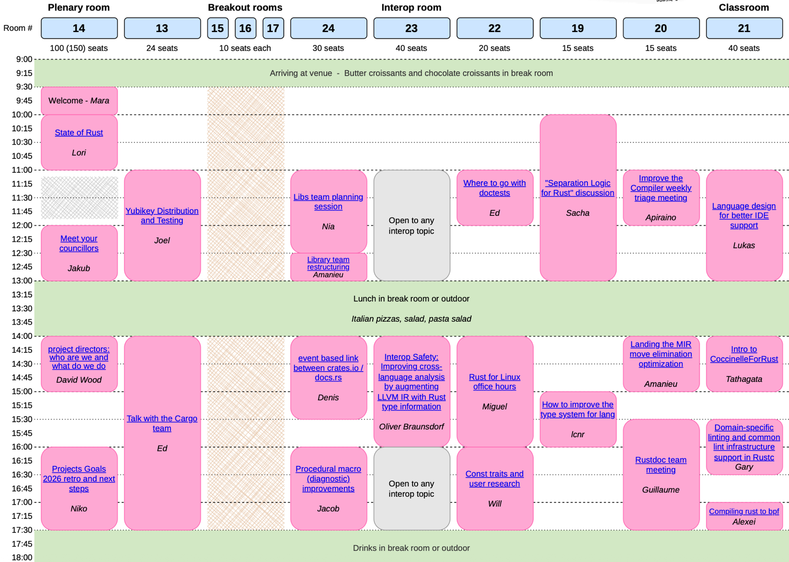

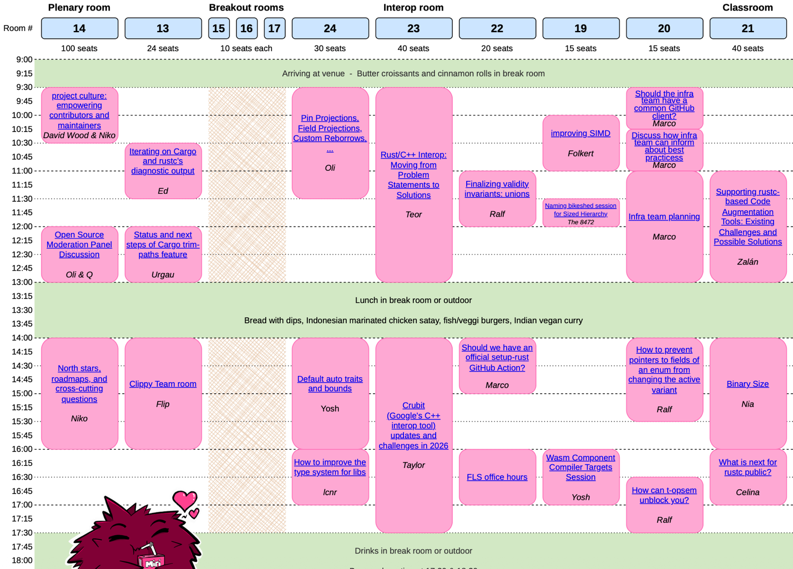

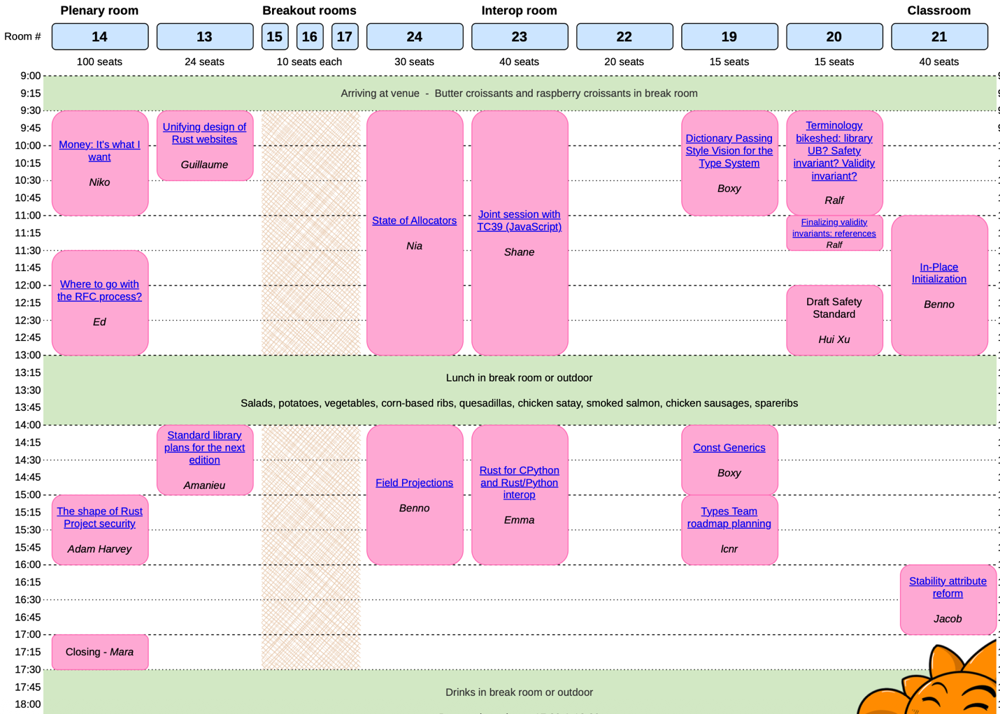

A couple of interesting *ad-hoc* huddles formed, and interesting discussions happened (not in the schedule above). Some passionate debates, many laughs, and stronger relationships have forged in our community.

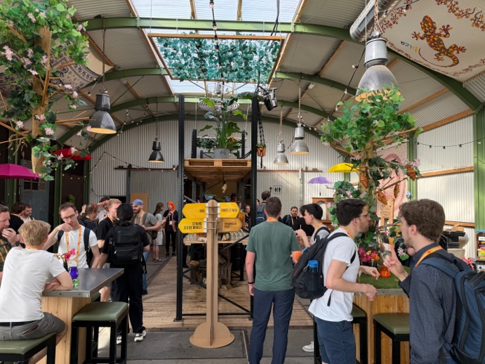 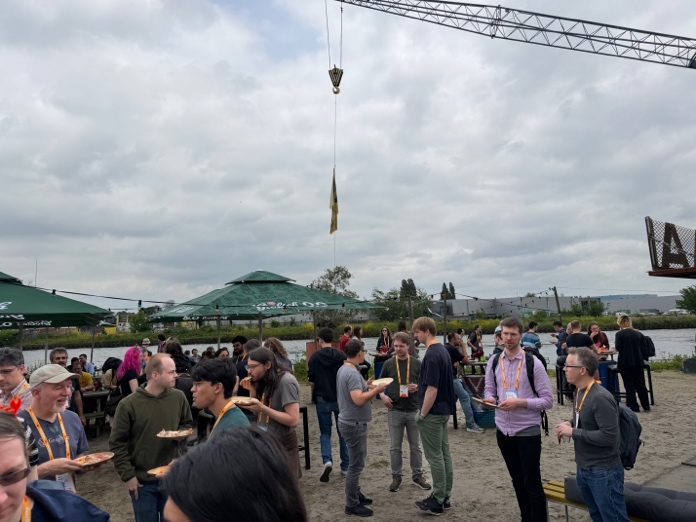

### Journal 📝

If you want to follow at home, we have a repo with full markdown **notes** from all sessions in the SGs:  
[github.com/rust-lang/all-hands-2026/issues](https://github.com/rust-lang/all-hands-2026/issues)

### That’s a wrap!

AllHands 2026 was amazing 🤩. Wonderful to spend a couple of days with these lovely people. In spite of all the fun, we managed to do some great work, too - Rust Project goals are progressing nicely.

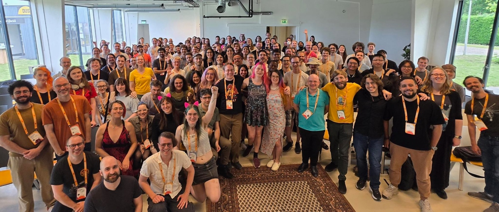

It’s a wrap. See you in 2027.  **Stay Rusty!** 

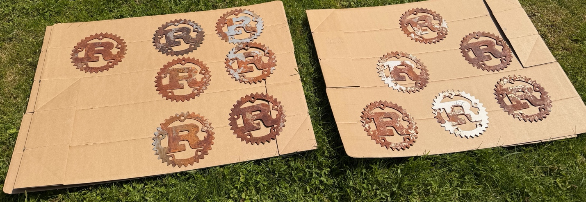  

(yes, some of us got real logos - *oxidated on site* - to take home 😄)
