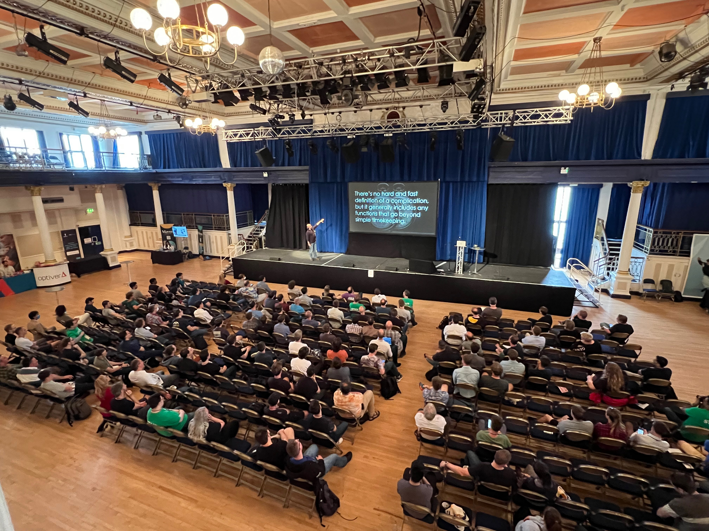

# C++ On Sea 2022 - Trip Report
Folkestone, UK, July 4-7  

This year, I was delighted to return (on-site) to the **C++ On Sea** conference. This post is a summary of the sessions I attended and enjoyed.  
Check out this [separate post](./tripreport.html) for my general impressions of the conference.  

## Sessions I liked

Out of the 3-day x 4 tracks [schedule](https://cpponsea.uk/2022/schedule/), full of interesting talks, I managed to attended 15 sessions that I found very engaging. Here they are, in chronological order.   

  
