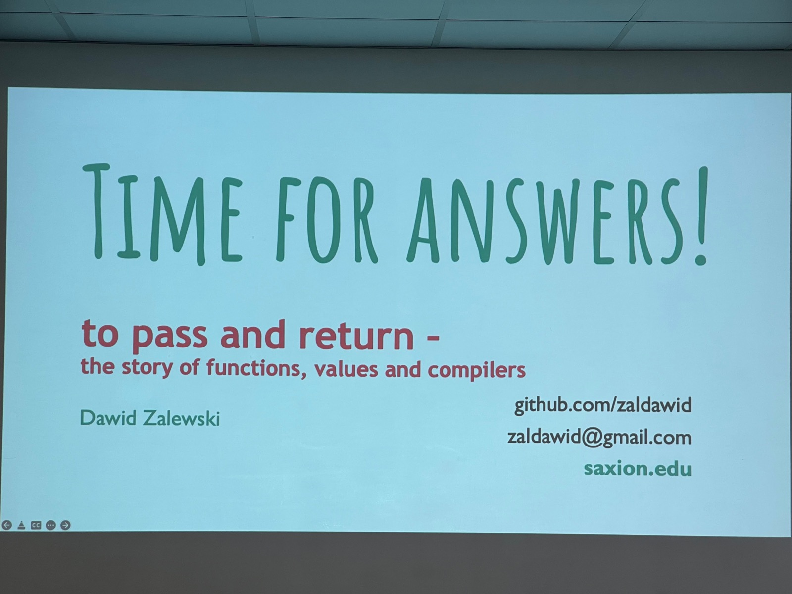

# C++ On Sea 2022 - Trip Report
Folkestone, UK, July 4-7  

This year, I was delighted to return (on-site) to the **C++ On Sea** conference. This post is a summary of the sessions I attended and enjoyed.  
Check out this [separate post](./tripreport.html) for my general impressions of the conference (trip report summary).  

## Plenary Sessions

This year's plenary sessions were:  

### Hana Dusíková - [Lightning Updates](https://cpponsea.uk/2022/sessions/keynote-lightning-updates.html)  
Hana presented a nifty custom differential update system (think "Git") as a showcase for cool C++20 features usage. Her skills of progressively walking us through the code and meticulously highlighting the important bits are legendary - enough said.  
  
  
  

### Kevlin Henney - [For the Sake of Complexity](https://cpponsea.uk/2022/sessions/midnote-for-the-sake-of-complexity.html)  
For me, Kevlin's keynotes are the highlight of any conference. As usual, he didn't disappoint.😄  
A fantastic overview of the complexity in software systems: from our code, from the nature of software development to the detail of coding habits, from design practices through to the core language.  
  
  
  

### Jason Turner - [Making C++ Fun, Safe, and Accessible](https://cpponsea.uk/2022/sessions/endnote-making-cpp-fun-safe-and-accessible.html)  
C++ has a reputation for being hard to learn with annoying errors and dangerous memory issues. Jason explores various ways in which we make C++ fun and safe and accessible to a larger audience.    
  
  

### Victor Ciura - [C++ MythBusters](https://cpponsea.uk/2022/sessions/plenary-cpp-mythbusters.html)  
... and my own session 😄  
I dissected a few of the most popular C++ myths to a level of detail not possible on Twitter… and without the stigma of newb/duplicate/eyeroll one might experience when asking these questions on StackOverflow. The familiar “Busted”, “Plausible”, or “Confirmed” verdicts on each myth. 
I probably started some controversy and hopefully constructive discussions around a few sensitive topics in contemporary C++.  
  

## Sessions I liked

Out of the 3-day x 4 tracks [schedule](https://cpponsea.uk/2022/schedule/), full of interesting talks, I managed to attended 15 sessions that I found very engaging. Here they are, in chronological order.   

### Walter E Brown - [A Medley of C++](https://cpponsea.uk/2022/sessions/a-medley-of-cpp.html)  
It is a real privilege to listen to Walter's stories, both on stage and especially on the hallway, during breaks. An industry veteran with tons of experience using various systems, languages, techniques and a wonderful human being eager to share his experience to younger generations. This set of short presentations were both captivating and informative. A must see!    
  

### Bryce Adelstein Lelbach - [C++ Standard Parallelism](https://cpponsea.uk/2022/sessions/cpp-standard-parallelism.html)  
X std::mdspan   
  
  
  

### Dawid Zalewski - [To pass and return — the story of functions, values and compilers](https://cpponsea.uk/2022/sessions/to-pass-and-return-the-story-of-functions-values-and-compilers.html)  
XXX  
  
  
  

### Ólafur Waage - [Sandbox Games: Using WebAssembly and C++ to make a simple game](https://cpponsea.uk/2022/sessions/sandbox-games-using-webassembly-and-cpp-to-make-a-simple-game.html)  
XXX  
  
  
  

### Daniela Engert - [Contemporary C++ in Action](https://cpponsea.uk/2022/sessions/contemporary-cpp-in-action.html)  
XXX  
  
  
  

### David Winterbottom - [Help, My Team Is Stuck In The 90s](https://cpponsea.uk/2022/sessions/help-my-team-is-stuck-in-the-90s.html)  
XXX  
  
  
  

### Anthony Williams - [An introduction to multithreading in C++20](https://cpponsea.uk/2022/sessions/an-introduction-to-multithreading-in-cpp20.html)  
XXX  
  
  
  

### Arne Mertz - [Identifying common code smells](https://cpponsea.uk/2022/sessions/identifying-common-code-smells.html)  
XXX  
  
  
  

### Peter Bindels - [What's in a bit - Designing, using and reverse-engineering binary file formats](https://cpponsea.uk/2022/sessions/whats-in-a-bit-designing-using-and-reverse-engineering-binary-file-formats.html)  
XXX  
  
  

### Jonathan Müller - [Coroutines: C++ vs Rust](https://cpponsea.uk/2022/sessions/coroutines-cpp-vs-rust.html)  
XXX  
  
  
  
  

### Guy Davidson - [Abstraction: the true superpower of C++](https://cpponsea.uk/2022/sessions/abstraction-the-true-superpower-of-cpp.html)  
XXX  
  
  

### Amir Kirsh - [Six ways for implementing max](https://cpponsea.uk/2022/sessions/six-ways-for-implementing-max-a-walk-through-api-design-dangling-references-and-cpp20-constraints.html)  
Six ways for implementing max: a walk through API design, dangling references and C++20 constraints ...   
  

