# C++ On Sea 2022 - Trip Report
Folkestone, UK, July 4-7  

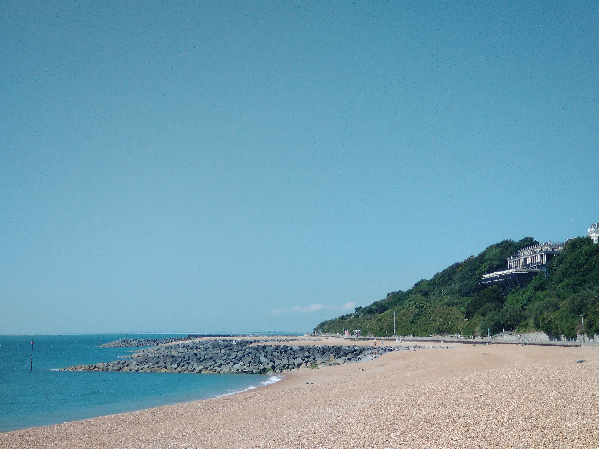  

## The Conference

[C++ on Sea](https://cpponsea.uk) is an international C++ conference taking place by the sea, in the UK. 
It started in 2019, kept going (online) during the pandemic and now returned in a hybrid format in 2022.  
Right from the start it attracted great speakers and a fantastic mix of attendees from all over Europe and even US/Canada. 

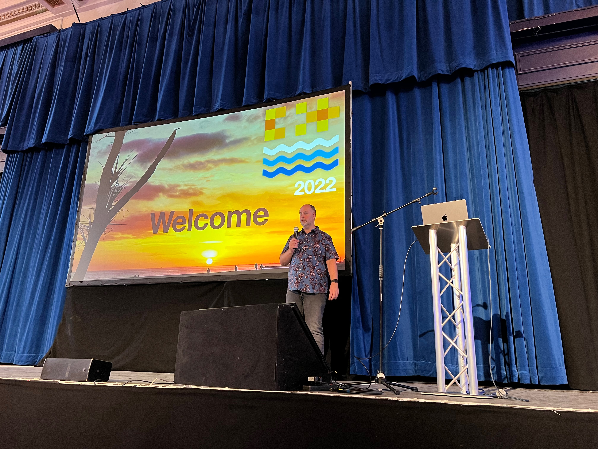  

## The Venue

C++ on Sea is hosted at the [Leas Cliff Hall](http://leascliffhall.co.uk) in Folkestone in Kent, UK, overlooking the English Channel. This historic seaside town is also home to The Channel tunnel and, as such, has excellent links to the rest of Europe.  
The Leas Cliff Hall is a working theater that also has a dedicated conference suite. Built into the cliffs, and with floor-to-ceiling glass overlooking the sea on three sides, the views are spectacular (if the classic British fog doesn't get in the way 😄). 

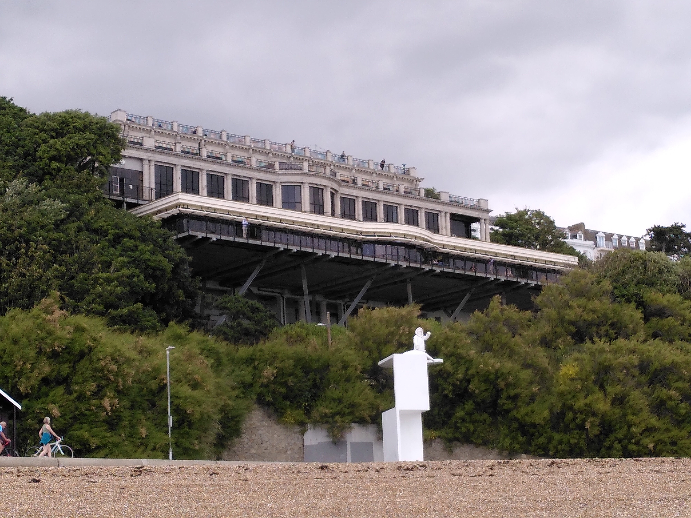  

## Social

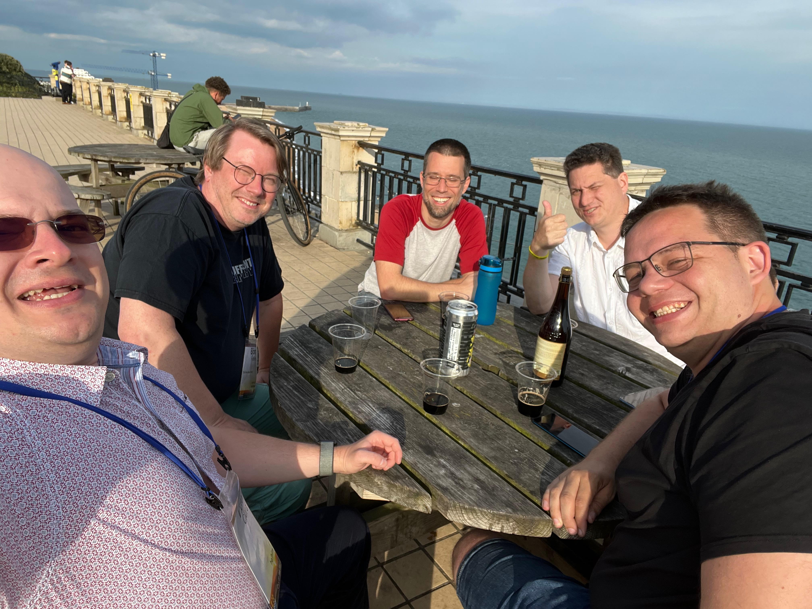  
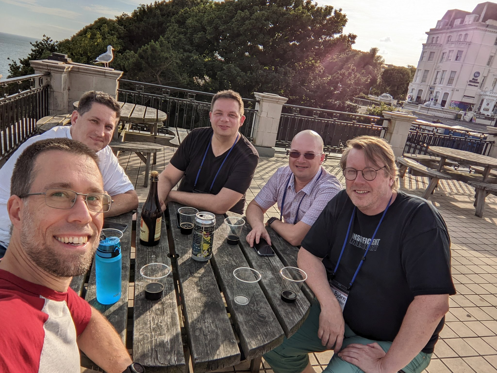  

## Agenda

[The schedule](https://cpponsea.uk/2022/schedule/) looked fantastic this year, as well. Lots of interesting talks I wanted to see and many new speakers made thier debute here. 

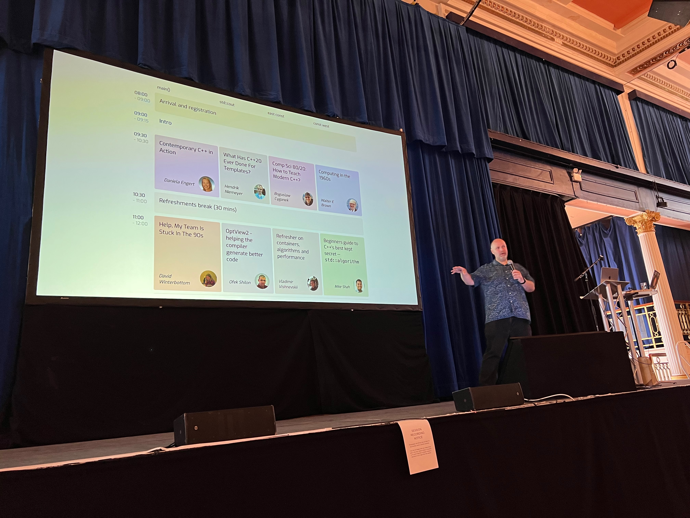  

### The Hallway Track

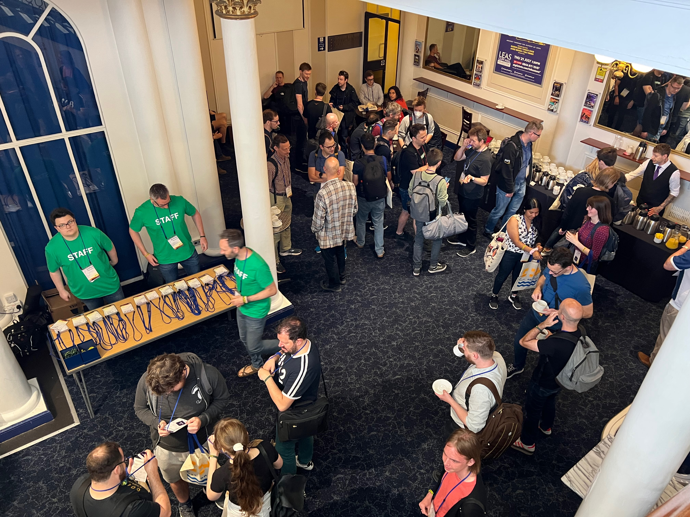  

### Plenary Sessions

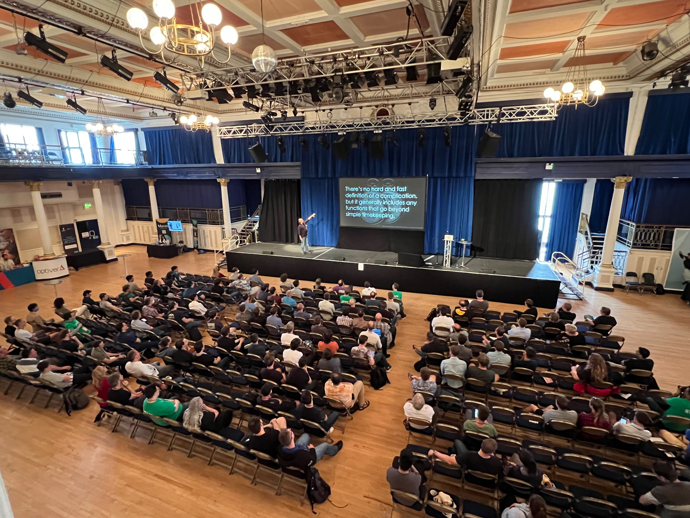  

Hana Dusíková - Lightning Updates  
https://cpponsea.uk/2022/sessions/keynote-lightning-updates.html

Kevlin Henney - For the Sake of Complexity  
https://cpponsea.uk/2022/sessions/midnote-for-the-sake-of-complexity.html

Jason Turner - Making C++ Fun, Safe, and Accessible  
https://cpponsea.uk/2022/sessions/endnote-making-cpp-fun-safe-and-accessible.html

... and my own session:  
I’m going to start some controversy and hopefully some constructive discussions around a few sensitive topics in contemporary C++.

Victor Ciura - C++ MythBusters  
https://cpponsea.uk/2022/sessions/plenary-cpp-mythbusters.html

### Lightning Talks  

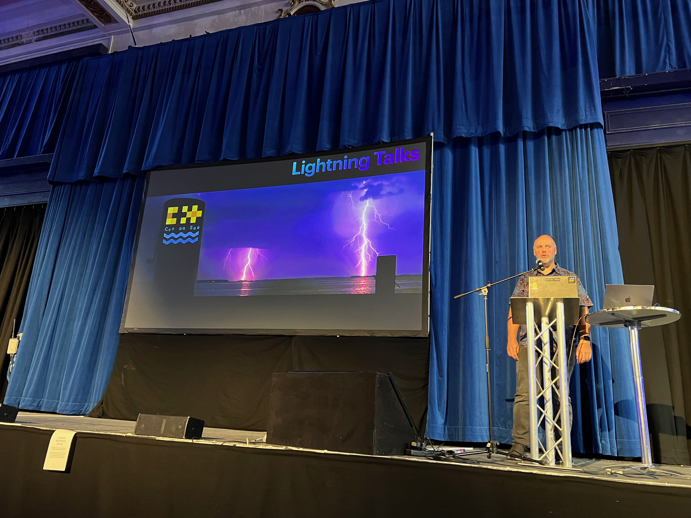  
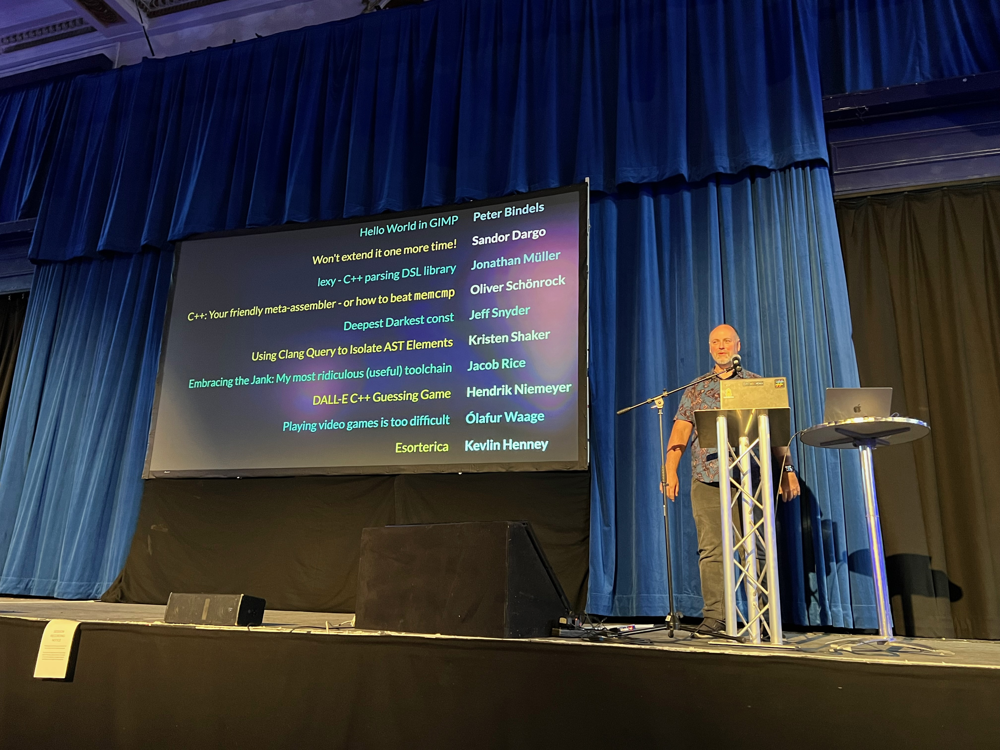  

## 2023 

I can't wait to return next year, to an even bigger in-person event!  
See ya!  
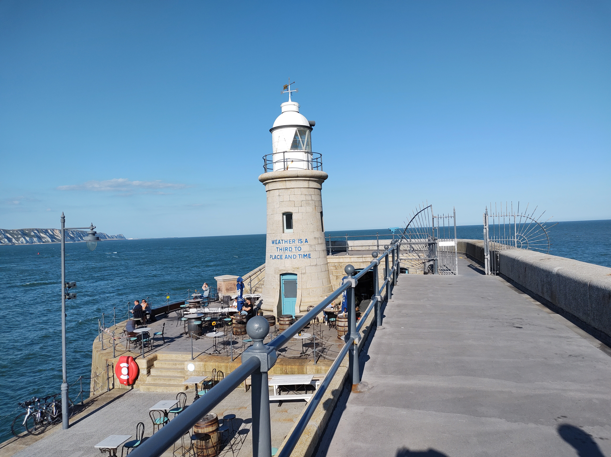  

