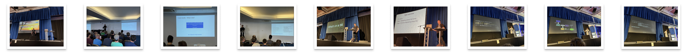
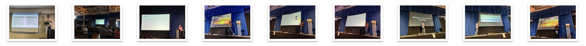

# C++ On Sea 2022 - Trip Report
Folkestone, UK, July 4-7  

  

## The Conference

[C++ on Sea](https://cpponsea.uk) is an international C++ conference taking place by the sea, in the UK. 
It started in 2019, kept going (online) during the pandemic and now returned in a hybrid format in 2022.  
Right from the start it attracted great speakers and a fantastic mix of attendees from all over Europe and even US/Canada.  
This year, there were almost 200 attendees on site, while others preferred to follow the online format from home. 

  

## The Venue

C++ on Sea is hosted at the [Leas Cliff Hall](http://leascliffhall.co.uk) in Folkestone in Kent, UK, overlooking the English Channel. This historic seaside town is also home to The Channel tunnel and, as such, has excellent links to the rest of Europe.  
The Leas Cliff Hall is a working theater that also has a dedicated conference suite. Built into the cliffs, and with floor-to-ceiling glass overlooking the sea on three sides, the views are spectacular (if the classic British fog doesn't get in the way 😄). 

  

## Agenda

[The schedule](https://cpponsea.uk/2022/schedule/) looked fantastic this year, as well. Lots of interesting presentations I wanted to see and many new speakers made thier debut here with captivating talks. More details about the sessions I attended, in this [separate post](./sessions.html). 

  

### The Hallway Track

As with all conferences, the best part is the "Hallway Track" cleverly disguised in the schedule as "refreshment breaks" between the sessions. Beside the opportunity to grab a drink or snack, the best part is that you get to do that with others and chat about the previous sessions, interesting work they're doing or get good recommendations of what presentation to attend next.  
For this venue, given the exceptionally great weather we had that week, taking the lunch up on the sun terrace was an unexpected delight each day. 

  

### Plenary Sessions

  

This year's plenary sessions were: 
- Hana Dusíková - [Lightning Updates](https://cpponsea.uk/2022/sessions/keynote-lightning-updates.html)
- Kevlin Henney - [For the Sake of Complexity](https://cpponsea.uk/2022/sessions/midnote-for-the-sake-of-complexity.html)
- Jason Turner - [Making C++ Fun, Safe, and Accessible](https://cpponsea.uk/2022/sessions/endnote-making-cpp-fun-safe-and-accessible.html)
- Victor Ciura 😄 - [C++ MythBusters](https://cpponsea.uk/2022/sessions/plenary-cpp-mythbusters.html)  

### Sessions 

  
  

Out of the 3-day x 4 tracks [schedule](https://cpponsea.uk/2022/schedule/), full of interesting talks, I managed to attended **15 sessions** that I found very engaging. Check out this [separate post](./sessions.html), where I go into detail about each one (with pictures 😄).  

### Lightning Talks  

A great way to end a full day of conference is to unwind with some entertaining & insightful short stories. The lineup of speakers signed up for this did not dissapoint. You'll have to check them out when the recordings are published. Here's the list as a teaser:  

  
  

## Social

I would be lying if I would say I went to C++ On Sea just for the great content. Truth is a big part of the joy was reuniting with great friends after 2+ years of pandemic and online events. 

  
  

## 2023 

I can't wait to return next year, to an even bigger in-person event!  
See ya!  
  

