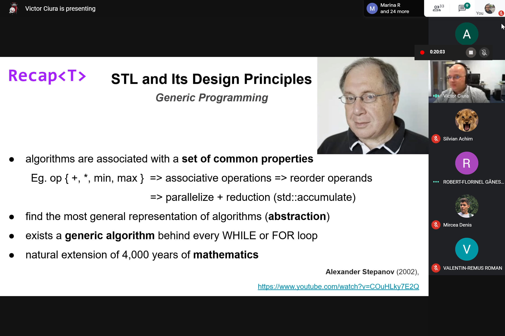

# ↩️ [Presentations()](https://cpp-red-lion.github.io/presentations/list.html)

## Part 1  

  
  
  
  
  
  
  
  
  
  

## Part 2  
(online live video lecture, due to COVID-19 pandemic)  

  
  
  
  
  
  
  
  
  
  
